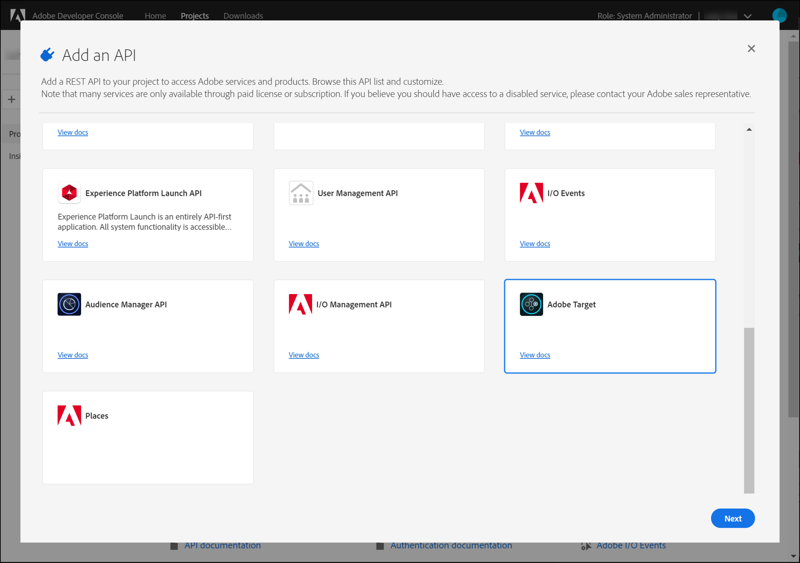
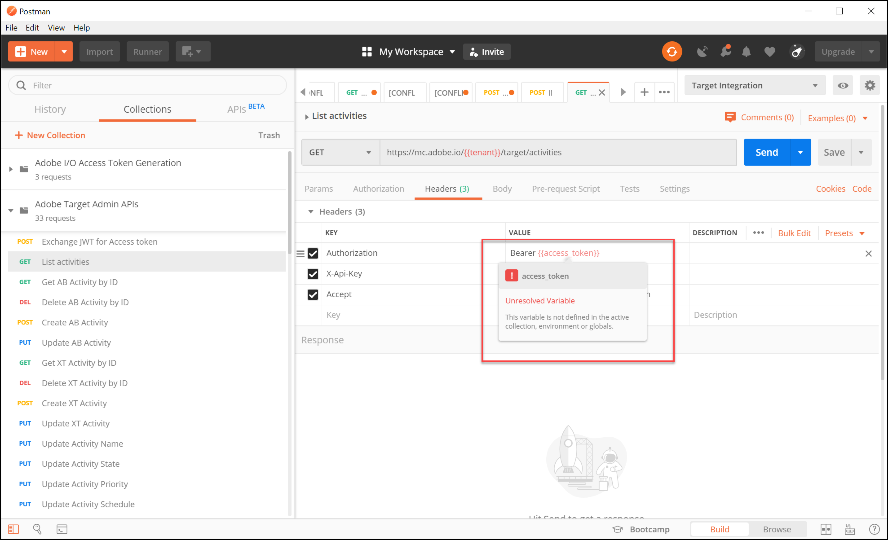

# Verificatie configureren voor [!DNL Adobe Target] API&#39;s

De [!DNL Adobe Target] Admin API&#39;s, inclusief [!DNL Recommendations Admin] API&#39;s, worden beveiligd door verificatie zodat alleen geautoriseerde gebruikers toegang hebben tot [!DNL Adobe Target]. Gebruik de [Adobe Developer Console](https://developer.adobe.com/console/home) deze verificatie voor iedereen beheren [!DNL Adobe Experience Cloud solutions], inclusief [!DNL Adobe Target].

>[!IMPORTANT]
>
>De geloofsbrieven van de Rekening van de Dienst (JWT) die in dit artikel worden beschreven zullen ten gunste van de nieuwe geloofsbrieven van Server-aan-Server OAuth worden afgekeurd.
>
>De aanmeldingsgegevens voor de serviceaccount (JWT) blijven geldig tot 1 januari 2025. U moet uw toepassing of integratie migreren om de nieuwe server-aan-server referentie OAuth vóór 1 Januari, 2025 te gebruiken.
>
>Voor meer informatie en geleidelijke instructies om uw integratie te migreren, zie [Migratie van JWT-referentie (Service Account) naar OAuth Server-to-Server-referentie](https://developer.adobe.com/developer-console/docs/guides/authentication/ServerToServerAuthentication/migration/){target=_blank} in de *Ontwerpconsole* documentatie.
>
>Voor informatie over het instellen van nieuwe OAuth-referenties raadpleegt u [OAuth Server-to-Server credentiële implementatie](https://developer.adobe.com/developer-console/docs/guides/authentication/ServerToServerAuthentication/implementation/){target=_blank} in de *Ontwerpconsole* documentatie.

Hier zijn de voorlopige stappen die nodig zijn om de oudere JWT-verificatietokens te genereren die nodig zijn om te kunnen communiceren met [!DNL Adobe Target] API&#39;s:

1. Maak een project (voorheen integratie genoemd) in het dialoogvenster [!DNL Adobe Developer Console].
1. Exporteer projectdetails naar Postman.
1. Genereer een toegangstoken voor toonder.
1. Test het toegangstoken van de drager.

## Voorwaarden

| Bron | Details |
| --- | --- |
| Postman | Als u deze stappen wilt voltooien, kunt u de opdracht [Postman-app](https://www.postman.com/downloads/) voor uw besturingssysteem. Postman basic is gratis bij het maken van accounts. Niet vereist voor gebruik [!DNL Adobe Target] API&#39;s in het algemeen maakt Postman API-workflows eenvoudiger, en [!DNL Adobe Target] biedt verschillende Postman-verzamelingen die helpen bij het uitvoeren van de API&#39;s en leren hoe ze werken. Voor de rest van deze handleiding wordt uitgegaan van praktische kennis van Postman. Zie voor hulp de [Postman-documentatie](https://learning.getpostman.com/). |
| Verwijzingen | In de rest van deze handleiding wordt ervan uitgegaan dat de volgende bronnen bekend zijn:<ul><li>[Adobe I/O Github](https://github.com/adobeio)</li><li>[Documentatie voor Admin en Profile API](../administer/admin-api/admin-api-overview-new.md)</li><li>[Recommendations API-documentatie](https://developers.adobetarget.com/api/recommendations/)</li></ul> |

## Een Adobe I/O-project maken

In deze sectie krijgt u toegang tot de [!DNL Adobe Developer Console] en maak een project voor [!DNL Adobe Target]. Raadpleeg voor meer informatie de [documentatie over projecten](https://developer.adobe.com/developer-console/docs/guides/projects/).

&lt;!---(1. Genereer uw persoonlijke sleutel en openbaar certificaat per [documentatie over verificatie](https://developer.adobe.com/developer-console/docs/guides/authentication/). // [//]: # (zoals beschreven in **Stap 1** van [Hoe te opstelling Adobe IO: Authentificatie - Stap voor Stap](https://helpx.adobe.com/marketing-cloud-core/kb/adobe-io-authentication-step-by-step.html). Na de voltooiing van Stap 1, terugkeer aan deze gids en hervat met Stap 2, hieronder. // Het resultaat van deze stap moet de instelling van een `private.key` en een `certificate_pub.crt` bestand. Keer terug naar deze gids zodra u deze twee dossiers hebt geproduceerd.)—>

1. In de [Adobe Admin Console](https://adminconsole.adobe.com/), zorg ervoor dat uw [!DNL Adobe] gebruikersaccount is toegekend aan beide [Productbeheerder](https://helpx.adobe.com/enterprise/using/admin-roles.html) en [Ontwikkelaar](https://helpx.adobe.com/enterprise/using/manage-developers.html) toegang tot [!DNL Target].

1. In de [Adobe Developer Console](https://developer.adobe.com/console/home), selecteert u de [!UICONTROL Experience Cloud Organization] waarvoor u deze integratie wilt creëren. (Let op: u hebt waarschijnlijk slechts toegang tot één [!UICONTROL Experience Cloud Organization].)

   

1. Klik op **[!UICONTROL Create new project]**.

   

1. Klikken **[!UICONTROL Add API]** om REST API aan uw project toe te voegen om toegang te hebben [!DNL Adobe] diensten en producten.

   

1. Selecteren **[!DNL Adobe Target]** als de [!DNL Adobe] service waarmee u wilt integreren. Klik op de knop **[!UICONTROL Next]** die wordt weergegeven.

   

1. Selecteer een optie om openbare en privé sleutels met de integratie van de de dienstrekening te associëren u voor creeert [!DNL Target]. In dit voorbeeld selecteert u **[!UICONTROL Option 1: Generate a key pair]** en klik op **[!UICONTROL Generate keypair]**.

   

1. Noteer het automatisch gedownloade configuratiebestand (`config`), dat uw persoonlijke sleutel bevat. Klik op **[!UICONTROL Next]**.

   

1. Controleer in uw bestandssysteem de locatie van `config`Dit is het gecomprimeerde configuratiebestand dat in de vorige stap is gemaakt. Nogmaals, dit `config` bevat uw persoonlijke sleutel, die u later nodig hebt. De exacte locatie in uw bestandssysteem kan afwijken van de locatie die u hier ziet.

   

1. Selecteer in de Adobe Developer Console de optie [productprofiel(en)](https://helpx.adobe.com/enterprise/using/manage-products-and-profiles.html) komt overeen met de eigenschappen waarin u Adobe Recommendations gebruikt. (Als u geen eigenschappen gebruikt, selecteert u de optie Standaardwerkruimte.) Klik op **[!UICONTROL Save configured API]**.

   

1. Klik op **[!UICONTROL Create Integration]**. U ontvangt een tijdelijk bericht dat aangeeft dat de API is geconfigureerd.
1. Als laatste stap wijzigt u de naam van het project in een naam die betekenisvoller is dan de naam van het oorspronkelijke project `Project 1`. Om dit te doen, navigeer aan het project gebruikend de navigatiepad zoals tonen, klik **[!UICONTROL Edit project]** toegang tot **[!UICONTROL Edit Project]** en hernoemen.

   

>[!NOTE]
>
>In dit voorbeeld noemen we ons project &quot;[!DNL Target] Integratie.&quot; Als u uw project voor meer dan enkel verwacht gebruikt [!DNL Adobe Target], kunt u het dienovereenkomstig noemen. U kunt bijvoorbeeld de naam &quot;Adobe API&#39;s&quot; of &quot;Experience Cloud API&#39;s&quot; wijzigen, omdat deze API&#39;s kunnen worden gebruikt met andere oplossingen in de Adobe Experience Cloud.

## Projectdetails exporteren

Nu hebt u een Adobe-project dat u kunt gebruiken voor toegang tot [!DNL Target], moet u ervoor zorgen om details van dat project samen met uw Adobe API verzoeken te verzenden. Deze gegevens zijn vereist voor interactie met verschillende Adobe-API&#39;s, waaronder diverse [!DNL Target] API&#39;s. De integratiedetails bevatten bijvoorbeeld autorisatie- en verificatiegegevens die vereist zijn voor de [!DNL Target] Admin API&#39;s. Als u de API&#39;s met Postman wilt gebruiken, moet u deze gegevens daarom naar Postman overbrengen.

Er zijn vele manieren om de details van uw project in Postman te specificeren, maar in deze sectie, profiteren wij van sommige pre-gebouwde eigenschappen en inzamelingen. Eerst (in deze sectie) exporteert u de details van uw integratie naar een Postman-omgeving. Daarna (in de volgende sectie), zult u een dragertoegangstoken produceren om u toegang tot de noodzakelijke middelen van Adobe te verlenen.

>[!NOTE]
>
>Voor video-instructies die van toepassing zijn op elke Experience Cloud-oplossing, inclusief [!DNL Target], zie [Postman gebruiken met Experience Platform-API&#39;s](https://experienceleague.adobe.com/docs/platform-learn/tutorials/platform-api-authentication.html). De volgende punten zijn relevant voor de [!DNL Target] API&#39;s: 1. Experience Platform-API maken en exporteren naar Postman 2. Genereer een toegangstoken met Postman. Deze stappen worden ook hieronder gegeven.

1. Nog steeds in de [Adobe Developer Console](https://developer.adobe.com/console/home), navigeert u om de **[!UICONTROL Service Account (JWT)]** referenties. Gebruik de linkernavigatie of de **[!UICONTROL Credentials]** zoals weergegeven.

   

   In **[!UICONTROL Credential details]**, let erop dat u uw **[!UICONTROL Public key(s)]**, **[!UICONTROL Client ID]** en andere informatie over uw serviceaccount.

   

1. Klik om naar informatie over de **[!DNL Adobe Target]** API. Gebruik de linkernavigatie of de **Verbonden producten en services** zoals weergegeven.

   

1. Klikken **[!UICONTROL Download for Postman]** > **[!UICONTROL Service Account (JWT)]** om een JSON-bestand te maken waarin uw verificatiegegevens worden vastgelegd voor een Postman-omgeving.

   

   Noteer het JSON-bestand in uw bestandssysteem.

   

1. Klik in Postman op het tandwielpictogram om uw omgevingen te beheren en klik vervolgens op **[!UICONTROL Import]** om het JSON-bestand (omgeving) te importeren.

   

1. Kies uw bestand en klik op **[!UICONTROL Open]**.

   

1. In de Postman **Omgevingen beheren** Klik op de naam van de nieuwe geïmporteerde omgeving om deze te inspecteren. (De naam van uw omgeving kan verschillen van de naam die u hier ziet. Bewerk de naam naar wens. Het hoeft niet noodzakelijkerwijs overeen te komen met de naam van de [!DNL Adobe] project.)

   

1. Opmerking `CLIENT_SECRET` en `API_KEY` (samen met andere variabelen) hun waarden vooraf invullen en uit uw integratie halen zoals gedefinieerd in de Adobe Developer-console. (De Postman `CLIENT_SECRET` variabele moet overeenkomen met `CLIENT SECRET` Adobe-referentie zoals weergegeven in de Developer Console, en `API_KEY` in Postman `CLIENT ID` in de Developer Console.) Notitie daarentegen `PRIVATE_KEY`, `JWT_TOKEN`, en `ACCESS_TOKEN` zijn leeg. Laten we beginnen met de `PRIVATE_KEY` waarde.

   

1. Open vanuit uw bestandssysteem uw `config` en opent u het `private` sleutelbestand.

   

1. Selecteer en kopieer de volledige inhoud van het dialoogvenster `private` sleutelbestand.

   

1. Plak in Postman uw waarde voor de persoonlijke sleutel in de **[!UICONTROL INITIAL VALUE]** en **[!UICONTROL CURRENT VALUE]** velden.

   

1. Klikken **[!UICONTROL Update]** en sluit het modaal milieu.

## Het toegangstoken voor toonder genereren

In deze sectie genereert u het toegangstoken aan toonder, dat vereist is voor het verifiëren van uw interactie met [!DNL Adobe Target] API&#39;s. Als u uw toegangstoken voor toonder wilt genereren, moet u uw integratiegegevens (die in de voorgaande secties zijn vastgelegd) naar de [Adobe Identity Management Service (IMS)](https://www.adobe.io/authentication/auth-methods.html#!AdobeDocs/adobeio-auth/master/AuthenticationOverview/AuthenticationGuide.md). Er zijn een paar verschillende manieren om dit te doen, maar in deze gids maken we gebruik van een Postman-collectie die een vooraf gebouwde IMS-aanroep bevat die het proces direct en eenvoudig maakt. Nadat u de verzameling hebt geïmporteerd, kunt u deze desgewenst opnieuw gebruiken om nieuwe tokens te genereren, niet alleen voor [!DNL Adobe Target], maar ook andere Adobe-API&#39;s.

1. Ga naar de [Voorbeeldaanroepen van de Adobe Identity Management Service API](https://github.com/adobe/experience-platform-postman-samples/tree/master/apis/ims).

   

1. Klik op de knop **[!UICONTROL Adobe I/O Access Token Generation Postman collection]**.

   

1. Haal de onbewerkte JSON voor deze verzameling op door op **[!UICONTROL Raw]** en kopieert u vervolgens de resulterende JSON naar het klembord. (U kunt de onbewerkte JSON ook opslaan als een .json-bestand.)

   

1. Importeer de verzameling in Postman door de onbewerkte JSON vanaf het Klembord te plakken en in te dienen. (U kunt ook het .json-bestand uploaden dat u hebt opgeslagen.) Klik op **[!UICONTROL Continue]**.

   

1. Selecteer de **[!UICONTROL IMS: JWT Generate + Auth via User Token]** verzoek in de inzameling van Postman van de Generatie van de Token van de Toegang van de Adobe I/O, zorg ervoor uw milieu wordt geselecteerd en klik **[!UICONTROL Send]** om het token te genereren.

   

   >[!NOTE]
   >
   >Dit toegangsteken aan toonder is 24 uur geldig. Verzend het verzoek opnieuw wanneer u een nieuw teken moet produceren.

1. Open nogmaals het modaal van Milieu&#39;s beheren en selecteer uw milieu.

   

1. Noteer de `ACCESS_TOKEN` en `JWT_TOKEN` waarden worden nu gevuld.

   

Vraag: Moet ik de inzameling van Postman van de Generatie van de Token van de Toegang van de Adobe I/O gebruiken om de Token van het Web JSON (JWT) en het toegangstoken van de toonder te produceren?

Antwoord: Nee. De inzameling van Postman van de Generatie van de Token van de Toegang van de Adobe I/O is beschikbaar als gemak om JWT en het toegangstoken van de tokens in Postman gemakkelijker te produceren. U kunt ook de mogelijkheden in de Adobe Developer-console gebruiken om het toegangstoken voor toonder handmatig te genereren.

## Test het toegangstoken aan toonder

In deze oefening, zult u uw nieuwe toegangsteken van de toverdrager gebruiken door een API verzoek te verzenden dat een lijst van activiteiten van uw terugwint [!DNL Target] account. Een succesvol antwoord geeft aan dat uw [!DNL Adobe] project en authentificatie werken zoals verwacht om API te gebruiken.

1. Het dialoogvenster Importeren [[!DNL Adobe Target] Admin API&#39;s Postman Collection](https://developers.adobetarget.com/api/#admin-postman-collection). Volg alle aanwijzingen totdat de verzameling in Postman is geïmporteerd.

   

1. Vouw de verzameling uit en noteer de **[!UICONTROL List activities]** verzoek.

   

1. Variabelen zoals `{{access_token}}` zijn aanvankelijk niet opgelost. U kunt dit probleem op verschillende manieren oplossen. U kunt bijvoorbeeld een nieuwe verzamelingsvariabele definiëren met de naam `{{access_token}}`—maar in deze handleiding wijzigt u in plaats daarvan de API-aanvraag om de Postman-omgeving die u eerder gebruikte te benutten. Hierdoor kan de omgeving blijven fungeren als één consistente consolidatie van alle variabelen die op Adobe-API&#39;s voorkomen.

   

1. Te vervangen tekst `{{access_token}}` with `{{ACCESS_TOKEN}}`.

   

1. Te vervangen tekst `{{api_key}}` with `{{API_KEY}}`.

   

1. Te vervangen tekst `{{tenant}}` with `{{TENANT_ID}}`. Opmerking `{{TENANT_ID}}` wordt nog niet herkend.

   

1. Open het modaal beheer van milieu&#39;s, en selecteer uw milieu.

   

1. Typ om een nieuw type toe te voegen `{{TENANT_ID}}` omgevingsvariabele. Kopieer en plak uw waarde voor de id van de huurder in de **[!UICONTROL INITIAL VALUE]** en **[!UICONTROL CURRENT VALUE]** velden voor uw nieuwe `TENANT_ID` omgevingsvariabele.

   

   >[!NOTE]
   >
   >De Tenant ID is anders dan uw [!DNL Target] `clientcode`. De huurder-id staat in de URL wanneer u bent aangemeld bij [!DNL Target]. Als u uw Tenant-id wilt verkrijgen, meldt u zich aan bij de Adobe Experience Cloud. Open [!DNL Target]en klik op de doelkaart. Gebruik de waarde van de huurder-id zoals vermeld in het URL-subdomein. Bijvoorbeeld als uw URL wanneer het programma openen aan [!DNL Adobe Target] is `<https://mycompany.experiencecloud.adobe.com/...>` Dan is je Tenant ID &quot;mijnbedrijf&quot;.

1. Verzend uw verzoek nadat u de juiste omgeving hebt geselecteerd. U ontvangt een reactie met uw lijst met activiteiten.

   

Nu u uw authentificatie van de Adobe hebt geverifieerd, kunt u het gebruiken om met te communiceren [!DNL Adobe Target] API&#39;s (en andere Adobe-API&#39;s). U kunt bijvoorbeeld [Recommendations API&#39;s gebruiken](recs-api/overview.md) om aanbevelingen te creëren of te beheren, of u kunt het met gebruiken [API voor doellevering](/help/dev/implement/delivery-api/overview.md).
