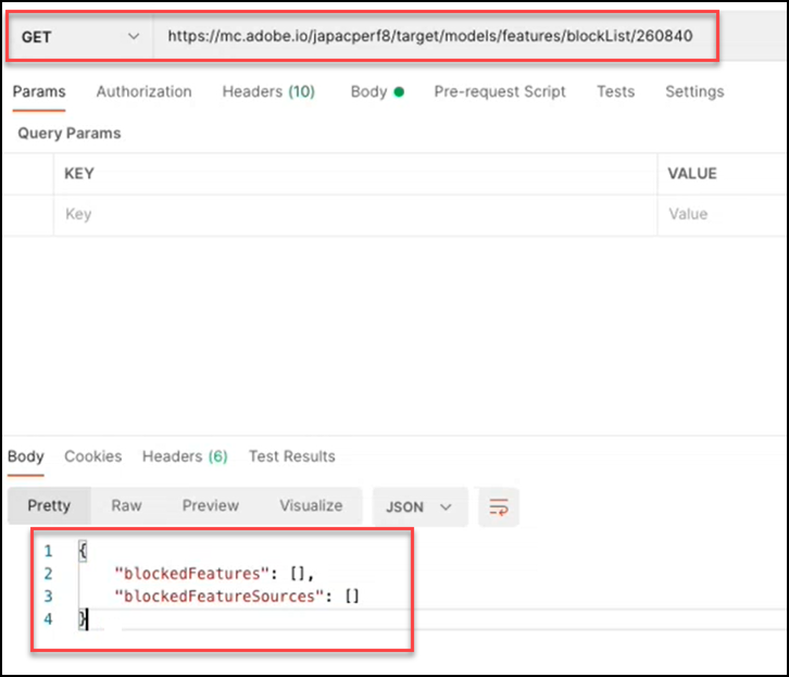

# Modellen API - Overzicht

Met de API Modellen, ook wel de Lijst van gewezen personen-API genoemd, kunnen gebruikers de lijst met functies weergeven en beheren die worden gebruikt in modellen voor machinaal leren voor [!UICONTROL Automated Personalization]- (AP) en [!DNL Auto-Target] -activiteiten (AT). Als een gebruiker een eigenschap van door de modellen voor AP of bij activiteiten zou willen uitsluiten worden gebruikt, kunnen zij Modellen API gebruiken om die eigenschap aan de &quot;lijst van gewezen personen toe te voegen.&quot;

Een **[!UICONTROL blocklist]** definieert de reeks functies die door [!DNL Adobe Target] worden uitgesloten van zijn leermodellen voor computers. Voor meer informatie over eigenschappen, zie [&#x200B; Gegevens die door  [!DNL Target]  worden gebruikt machine-leert algoritmen &#x200B;](https://experienceleague.adobe.com/docs/target/using/activities/automated-personalization/ap-data.html?lang=nl-NL).

Lijsten van gewezen personen kunnen worden gedefinieerd per activiteit (activiteitsniveau) of voor alle activiteiten binnen een [!DNL Target] -account (algemeen niveau).

<!-- To get started with the Models API in order to create and manage your blocklist, download the Postman Collection [here](https://git.corp.adobe.com/target/ml-configuration-management-service/tree/nextRelease/rest_api_library). Note this is an Adobe internal link. Need to publish this publicly if want to share with customers. -->

## Modellen API-specificatie

Bekijk hier de Modellen API specificatie [&#x200B; &#x200B;](../administer/models-api/models-api-overview.md).

## Vereisten

Om de Modellen API te gebruiken, moet u authentificatie vormen gebruikend [&#x200B; Adobe Developer Console &#x200B;](https://developer.adobe.com/console/home), enkel zoals u met [&#x200B; Admin API van het Doel &#x200B;](../administer/admin-api/admin-api-overview-new.md) zou. Voor meer informatie, zie [&#x200B; hoe te om Authentificatie &#x200B;](../before-administer/configure-authentication.md) te vormen.

## Richtlijnen voor gebruik van modellen-API

Hoe te om lijsten van gewezen personen te beheren

[**Stap 1:**](#step1) lijst van de Mening van eigenschappen voor een activiteit

[**Stap 2:**](#step2) controleer de lijst van gewezen personen van de activiteit

[**Stap 3:**](#step3) voegt eigenschappen aan de lijst van gewezen personen van de activiteit toe

[**Stap 4:**](#step4) (Facultatieve) Unblock

[**Stap 5:**](#step5) (Facultatief) beheert de globale lijst van gewezen personen


## Stap 1: Lijst met functies voor een activiteit weergeven {#step1}

Voordat u een functie voegt op lijst van gewenste personen, bekijkt u de lijst met functies die momenteel worden opgenomen in de modellen voor die activiteit.

>[!BEGINTABS]

>[!TAB  Verzoek ]

```json {line-numbers="true"}
GET https://mc.adobe.io/<tenant>/target/models/features/<campaignId>
```

>[!TAB  Reactie ]

```json {line-numbers="true"}
{
    "features": [
        {
            "externalName": "Visitor Profile - Total Visits to Activity",
            "internalName": "SES_PREVIOUS_VISIT_COUNT",
            "type": "CONTINUOUS"
        },
        {
            "externalName": "Visitor Profile - Total Visits",
            "internalName": "SES_TOTAL_SESSIONS",
            "type": "CONTINUOUS"
        },
        {
            "externalName": "Visitor Profile - Pages Seen Before Activity",
            "internalName": "SES_PREVIOUS_VISIT_COUNT",
            "type": "CONTINUOUS"
        },
        {
            "externalName": "Visitor Profile - Activity Lifetime Time on Site",
            "internalName": "SES_TOTAL_TIME",
            "type": "CONTINUOUS"
        }
    ],
    "reportParameters": {
        "clientCode": <tenant>,
        "campaignId": <campaignId>
    }
}
```

>[!ENDTABS]

<!-- JUDY: Update codeblock above once you have the complete Response. -->

In het hier getoonde voorbeeld, controleert de gebruiker om de lijst van eigenschappen te zien die in het model voor de activiteit worden gebruikt waarvan identiteitskaart van de Activiteit 260840 is.


>[!NOTE]
>
>Navigeer naar de Activiteitenlijst in de [!DNL Target] gebruikersinterface om de activiteit-id van uw activiteit te zoeken. Klik op de activiteit van belang. De activiteit-id wordt weergegeven in de hoofdtekst van de resulterende pagina Overzicht van activiteiten en aan het einde van de URL voor die pagina.

**[!UICONTROL externalName]** is een gebruiksvriendelijke naam voor een functie. Deze wordt gemaakt door [!DNL Target] en het is mogelijk dat deze waarde in de loop van de tijd verandert. De gebruikers kunnen deze gebruikersvriendelijke namen in het [&#x200B; rapport van de Inzichten van Personalization &#x200B;](https://experienceleague.adobe.com/docs/target/using/reports/insights/personalization-insights-reports.html?lang=nl-NL) bekijken.

De **[!UICONTROL internalName]** is de werkelijke id van de functie. Deze wordt ook gemaakt door [!DNL Target] , maar kan niet worden gewijzigd. Dit is de waarde waarnaar u moet verwijzen om de functie(s) te identificeren die u wilt lijsten van gewezen personen.

Houd er rekening mee dat de lijst met functies alleen waarden kan bevatten (zodat deze niet null is) als een activiteit:

1. Status = Live hebben of eerder geactiveerd zijn
1. Er moet lang genoeg zijn geweest om campagne-activiteit te kunnen voeren, zodat het model gegevens heeft om tegen te lopen.

## Stap 2: Controleer de lijst van gewezen personen van de activiteit {#step2}

Bekijk nu de lijst van gewezen personen. Met andere woorden, controleer of er functies zijn die momenteel niet in de modellen voor deze activiteit kunnen worden opgenomen.

>[!ERROR]
>
>`/blockList/` is hoofdlettergevoelig in de aanvraag.

>[!BEGINTABS]

>[!TAB  Verzoek ]

```json {line-numbers="true"}
GET https://mc.adobe.io/<tenant>/target/models/features/blockList/<campaignId>
```

>[!TAB  Reactie ]

```json {line-numbers="true"}

```

>[!ENDTABS]

In het hier weergegeven voorbeeld controleert de gebruiker de lijst met geblokkeerde functies voor de activiteit waarvan de activiteit-id 260840 is. De resultaten zijn leeg, wat betekent dat deze activiteit momenteel geen gevoegde op lijst van gewenste personen functies heeft.


>[!NOTE]
>
>U ziet mogelijk lege resultaten zoals deze, de eerste keer dat u de volledige lijst van gewezen personen controleert voordat u er functies aan toevoegt. Als u echter functies uit een lijst van gewezen personen hebt toegevoegd (en vervolgens verwijderd), ziet u mogelijk iets andere resultaten, waarbij een lege, op de lijst met ongewenste personen staan array met functies wordt geretourneerd. Ga verder lezend om een voorbeeld van dit in [&#x200B; te zien Stap 4 &#x200B;](#step4).

## Stap 3: voeg eigenschappen aan de lijst van gewezen personen van de activiteit toe {#step3}

Als u functies wilt toevoegen aan de lijst van gewezen personen, wijzigt u de aanvraag van GET in PUT en wijzigt u de hoofdtekst van de aanvraag om de `blockedFeatureSources` of `blockedFeatures` naar wens op te geven.

* Voor de hoofdtekst van de aanvraag is `blockedFeatures` of `blockedFeatureSources` vereist. Beide kunnen worden opgenomen.
* Vul `blockedFeatures` met waarden die zijn geïdentificeerd uit `internalName` . Zie [&#x200B; Stap 1 &#x200B;](#step1).
* Vul `blockedFeatureSources` met waarden uit de onderstaande tabel.

`blockedFeatureSources` geeft aan waar een functie vandaan komt. Voor het voegend op lijst van gewenste personen maken dienen zij als groepen of categorieën eigenschappen, die gebruikers toelaten om volledige reeksen eigenschappen in één keer te blokkeren. De waarden van `blockedFeatureSources` komen overeen met de eerste tekens van de id van een functie (`blockedFeatures` of `internalName` waarden); daarom kunnen deze ook als &#39;functievoorvoegsels&#39; worden beschouwd.

### Tabel met `blockedFeatureSources` waarden {#table}

| Voorvoegsel | Beschrijving |
| --- | --- |
| VAK | Mbox, parameter |
| URL | Aangepast - URL-parameter |
| ENV | Omgeving |
| SES | Bezoekerprofiel |
| GEO | Geo-locatie |
| PRO | Aangepast - profiel |
| SEG | Aangepast - segment rapporteren |
| AAM | Aangepast - Experience Cloud-segment |
| MOB | Mobiel |
| CRS | Aangepast - Klantkenmerken |
| UPA | Aangepast - RT-CDP-profielkenmerk |
| IAC | Belangengebieden bezoekers |

>[!BEGINTABS]

>[!TAB  Verzoek ]

```json {line-numbers="true"}
PUT https://mc.adobe.io/<tenant>/target/models/features/blockList/<campaignId>

{
    "blockedFeatureSources": ["AAM"],
    "blockedFeatures": ["SES_PREVIOUS_VISIT_COUNT", "SES_TOTAL_SESSIONS"]
}
```

>[!TAB  Reactie ]

```json {line-numbers="true"}
{
    "blockedFeatures": [
            "SES_PREVIOUS_VISIT_COUNT",
            "SES_TOTAL_SESSIONS"
        ],
    "blockedFeatureSources": [
            "AAM"
        ]
}
```

>[!ENDTABS]

In het hier getoonde voorbeeld, blokkeert de gebruiker twee eigenschappen, `SES_PREVIOUS_VISIT_COUNT` en `SES_TOTAL_SESSIONS`, die zij eerder door de volledige lijst van eigenschappen voor de activiteit te vragen waarvan identiteitskaart van de Activiteit 260480 is, zoals die in [&#x200B; Stap 1 &#x200B;](#step1) wordt beschreven. Zij blokkeren ook alle eigenschappen die uit de Segmenten van Experience Cloud komen, die door eigenschappen met de prefix van &quot;AAM,&quot;zoals die in de [&#x200B; lijst &#x200B;](#table) hierboven wordt beschreven te blokkeren worden bereikt.


Merk op dat na het voegend op lijst van gewenste personen een eigenschap, het wordt geadviseerd dat u de bijgewerkte lijst van gewezen personen door [&#x200B; Stap 2 &#x200B;](#step2) opnieuw uit te voeren (GET de lijst van gewezen personen) verifieert. Controleer of de resultaten er goed uitzien (controleer of de resultaten de functies bevatten die zijn toegevoegd uit de meest recente PUT-aanvraag).

## Stap 4: (Optioneel) Blokkeren opheffen {#step4}

Als u alle op de lijst met ongewenste personen staan functies wilt ontgrendelen, wist u de waarden uit `blockedFeatureSources` of `blockedFeatures` .

>[!BEGINTABS]

>[!TAB  Verzoek ]

```json {line-numbers="true"}
PUT https://mc.adobe.io/<tenant>/target/models/features/blockList/<campaignId>

{
    "blockedFeatureSources": [],
    "blockedFeatures": []
}
```

>[!TAB  Reactie ]

```json {line-numbers="true"}
{
    "blockedFeatures": [],
    "blockedFeatureSources": []
}
```

>[!ENDTABS]

In het hier getoonde voorbeeld, ontruimt de gebruiker hun lijst van gewezen personen voor de activiteit waarvan identiteitskaart van de Activiteit 260840 is. Merk op dat de reactie lege series voor zowel geblokkeerde eigenschappen als hun bronnen bevestigt— `blockedFeatureSources` en `blockedFeatures`, respectievelijk.


Zoals altijd, na het wijzigen van de lijst van gewezen personen, adviseert men dat u [&#x200B; Stap 2 &#x200B;](#step2) opnieuw uitvoert (GET de lijst van gewezen personen om de lijst te verifiëren omvat eigenschappen zoals verwacht). In het hier weergegeven voorbeeld controleert de gebruiker of zijn lijst van gewezen personen nu leeg is.



Vraag: Hoe kan ik sommige, maar niet alle, lijsten van gewezen personen verwijderen?

Antwoord: Om een discrete ondergroep van op de lijst met ongewenste personen staan eigenschappen uit een multi-eigenschapslijst van gewezen personen te verwijderen, kunnen de gebruikers de bijgewerkte lijst van eigenschappen eenvoudig verzenden zij in [&#x200B; het verzoek van de lijst van gewezen personen &#x200B;](#step3), in tegenstelling tot het ontruimen van de volledige lijst van gewezen personen zouden willen blokkeren en de gewenste eigenschappen opnieuw toevoegen. Met andere woorden, verzend de bijgewerkte eigenschaplijst (zoals aangetoond in [&#x200B; Stap 3 &#x200B;](#step3)), die ervoor zorgen om de eigenschappen uit te sluiten u wenst om &quot;te schrappen&quot;van de lijst van gewezen personen.

## Stap 5: (Optioneel) Beheer de algemene lijst van gewezen personen {#step5}

De bovenstaande voorbeelden hadden allemaal betrekking op één enkele activiteit. U kunt eigenschappen voor alle activiteiten over een bepaalde cliënt (huurder) ook blokkeren, in plaats van het moeten de lijst van gewezen personen voor elke activiteit afzonderlijk specificeren. Als u een algemene lijst van gewezen personen wilt uitvoeren, gebruikt u de aanroep `/blockList/global` in plaats van `blockList/<campaignId>` .

>[!BEGINTABS]

>[!TAB  Verzoek ]

```json {line-numbers="true"}
PUT https://mc.adobe.io/<tenant>/target/models/features/blockList/global

{
    "blockedFeatureSources": ["AAM", "PRO", "ENV"],
    "blockedFeatures": ["AAM_FEATURE_1", "AAM_FEATURE_2"]
}
```

>[!TAB  Reactie ]

```json {line-numbers="true"}
{
    "blockedFeatures": [
        "AAM_FEATURE_1",
        "AAM_FEATURE_2"
    ],
    "blockedFeatureSources": [
        "AAM",
        "PRO",
        "ENV"
    ]
}
```

>[!ENDTABS]

In de voorbeeldaanvraag hierboven blokkeert de gebruiker twee functies, &quot;AAM_FEATURE_1&quot; en &quot;AAM_FEATURE_2&quot;, voor alle activiteiten in hun [!DNL Target] -account. Dit betekent dat, ongeacht de activiteit, &quot;AAM_FEATURE_1&quot; en &quot;AAM_FEATURE_2&quot; niet zullen worden opgenomen in de modellen voor machinaal leren voor dit account. Bovendien blokkeert de gebruiker wereldwijd ook alle functies waarvan het voorvoegsel &quot;AAM&quot;, &quot;PRO&quot; of &quot;ENV&quot; is.

Vraag: Is het bovenstaande codevoorbeeld niet overbodig?

Antwoord: Ja. Het is overbodig om functies te blokkeren met waarden die beginnen met &quot;AAM&quot; en tegelijkertijd alle functies te blokkeren waarvan de bron &quot;AAM&quot; is. Het nettoresultaat is dat alle functies van AAM (Experience Cloud Segments) worden geblokkeerd. Daarom als het doel is om alle eigenschappen van de Segmenten van Experience Cloud te blokkeren, individueel het specificeren van bepaalde eigenschappen die met &quot;AAM&quot;beginnen is onnodig, in het bovenstaande voorbeeld.

Laatste stap: Of dit nu op het niveau van de activiteit of wereldwijd is, u wordt aangeraden de lijst van gewezen personen te verifiëren nadat u deze hebt gewijzigd, om er zeker van te zijn dat deze de waarden bevat die u verwacht. Dit doet u door de `PUT` in een `GET` te wijzigen.

De voorbeeldreactie hieronder geeft aan dat [!DNL Target] twee afzonderlijke functies blokkeert, plus alle functies die afkomstig zijn van &quot;AAM&quot;, &quot;PRO&quot; en &quot;ENV&quot;.


