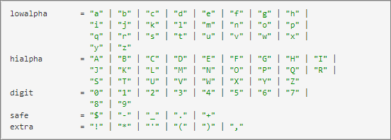

# Paginaparameters

Paginaparameters (ook wel &quot;parameters mbox&quot; genoemd) zijn naam-/waardeparen die rechtstreeks via paginacode worden doorgegeven en die niet in het profiel van de bezoeker worden opgeslagen voor toekomstig gebruik.

Paginaparameters zijn handig voor het verzenden van paginagegevens naar [!DNL Adobe Target] dat niet hoeft te worden opgeslagen met het profiel van de bezoeker voor toekomstig doelgericht gebruik. Deze waarden worden in plaats daarvan gebruikt om de pagina of de actie te beschrijven die de gebruiker op de specifieke pagina heeft ondernomen.

## Indeling

Paginaparameters worden doorgegeven aan [!DNL Target] via een serveraanroep als een naam-/waardepaar. Parameternamen en -waarden kunnen worden aangepast (hoewel er enkele &#39;gereserveerde namen&#39; zijn voor specifieke toepassingen).

Hier volgen enkele voorbeelden van paginaparameters

* `page=productPage`

* `categoryId=homeLoans`

## Voorbeelden van gebruiksgevallen

* **Productpagina&#39;s**: Verstuur informatie over het bekeken specifieke product (deze methode is hoe Recommendations werkt)
* **Bestelgegevens**: verzend orde ID, orderTotal, etc. voor ordeverzameling
* **Categorie-affiniteit**: Verstuur de weergegeven gegevens van de rubriek naar [!DNL Target] kennis opdoen van de affiniteit van de gebruiker met bepaalde sitecategorieën
* **Gegevens van derden**: Verstuur informatie van derde gegevensbronnen, zoals weergerichte leveranciers, rekeningsgegevens (bijvoorbeeld, DemandBase), demografische gegevens (bijvoorbeeld Experian), en meer.

## Voordelen van de methode

Gegevens die worden verzonden naar [!DNL Target] in real time, en kan op de zelfde server worden gebruikt roept de gegevens waarop het binnen komt.

## Caveats

* Vereist een update van de paginacode (direct of via een systeem voor tagbeheer).
* Als de gegevens voor het richten op een volgende pagina/servervraag moeten worden gebruikt, moet het in een profielmanuscript worden vertaald.
* Zoektekenreeksen kunnen alleen tekens bevatten volgens de [Internet Engineering Task Force (IETF)-standaard](https://www.ietf.org/rfc/rfc3986.txt) .

  Naast de op de IETF-site vermelde tekens, [!DNL Target] staat de volgende karakters in vraagkoorden toe:

  ```< > # % " { } | \ ^ [ ] ` ``` {line-numbers=&quot;true&quot;}

  Al het andere moet met url gecodeerd zijn. De standaard geeft de volgende notatie aan ( [https://www.ietf.org/rfc/rfc1738.txt](https://www.ietf.org/rfc/rfc1738.txt) ), zoals hieronder wordt geïllustreerd:

  

  Of, de volledige lijst voor eenvoud:

  

## Codevoorbeelden

targetPageParamsAll (voegt de parameters aan alle mbox vraag op de pagina toe):

`function targetPageParamsAll() { return "param1=value1&param2=value2&p3=hello%20world";`

targetPageParams (voegt de parameters aan globale mbox op de pagina toe):

`function targetPageParams() { return "param1=value1&param2=value2&p3=hello%20world";`

## Koppelingen naar relevante informatie

Recommendations: [Implementatie volgens paginatype](https://experienceleague.adobe.com/docs/target/using/recommendations/plan-implement.html?lang=nl-NL)

Bevestiging van bestelling: [Conversies bijhouden](../../implement/client-side/atjs/how-to-deployatjs/implement-target-without-a-tag-manager.md#track-conversions)

Categorie-affiniteit: [Categorie-affiniteit](https://experienceleague.adobe.com/docs/target/using/audiences/visitor-profiles/category-affinity.html?lang=nl-NL)
