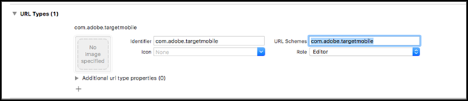
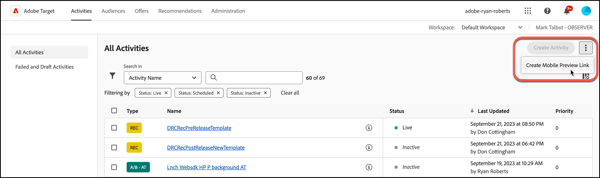

# [!DNL Target] mobiele voorvertoning

Gebruik de koppeling voor mobiele voorvertoningen om eenvoudige end-to-end QA&#39;s voor mobiele app-activiteiten uit te voeren en uzelf in te schrijven voor verschillende ervaringen op uw apparaat zonder speciale testapparaten.

>[!NOTE]
>
>Voor de functie voor mobiele voorvertoningen moet u de juiste 4.14 (of hoger) versie van de Adobe Mobile SDK downloaden en installeren.

## Overzicht

Met de functie voor mobiele voorvertoningen kunt u uw mobiele-toepassingsactiviteiten volledig testen voordat u deze live start.

## Vereisten

1. **Gebruik een ondersteunde versie van de SDK:** Voor de functie voor mobiele voorvertoningen moet u de juiste versie 4.14 (of hoger) van de Adobe Mobile SDK downloaden en installeren in de corresponderende apps.

   Voor instructies voor het downloaden van de juiste SDK raadpleegt u:

   * **iOS:** [Voordat u begint](https://experienceleague.adobe.com/docs/mobile-services/ios/getting-started-ios/requirements.html) in de *IOS Help voor mobiele services*.
   * **Android:** [Voordat u begint](https://experienceleague.adobe.com/docs/mobile-services/android/getting-started-android/requirements.html) in de *Help bij Mobile Services Android*.

1. **Een URL-schema instellen:** De voorbeeldkoppeling gebruikt een URL-schema om uw app te openen. U moet een uniek URL-schema opgeven voor de voorvertoning.

   De volgende illustratie is een voorbeeld op iOS:

   

   De volgende afbeelding is een voorbeeld op Android:

   

1. **Track Adobe DeepLink**

   **iOS:** In de toepassingsafgevaardigde, vraag `[ADBMobile trackAdobeDeepLink:url` wanneer de gedelegeerde wordt gevraagd om de bron te openen met het URL-schema dat in de vorige stap is opgegeven.

   Het volgende codefragment is een voorbeeld:

   ```javascript {line-numbers="true"}
   - (BOOL) application:(UIApplication *)app openURL:(NSURL *)url 
                options:(NSDictionary<NSString *,id> *)options { 
   
       if ([[url scheme] isEqualToString:@"com.adobe.targetmobile"]) { 
           [ADBMobile trackAdobeDeepLink:url]; 
           return YES; 
       } 
       return NO; 
   } 
   ```

   **Android:** In de app roept u `Config.trackAdobeDeepLink(URL);` wanneer de bezoeker wordt gevraagd om het middel met het URL-schema te openen dat in de vorige stap werd gespecificeerd.

   ```javascript {line-numbers="true"}
    private Boolean shouldOpenDeeplinkUrl() { 
        Intent appLinkIntent = getIntent(); 
        String appLinkAction = appLinkIntent.getAction(); 
        Uri appLinkData = appLinkIntent.getData; 
        if (appLinkData.toString().startsWith("com.adobe.targetmobile")) { 
            Config.trackAdobeDeepLink(appLinkData); 
            return true; 
        } 
        return false; 
     }
   ```

   Als u Mobiele voorvertoning wilt laten werken voor Android, moet u ook het volgende codefragment toevoegen in AndroidManifest.xml als u versie 5 van de Adobe Mobile SDK gebruikt:

   ```javascript {line-numbers="true"}
   <activity android:name="com.adobe.marketing.mobile.FullscreenMessageActivity" />
   ```

   Gebruik het volgende codefragment als u versie 4 van de Adobe Mobile SDK gebruikt:

   ```javascript {line-numbers="true"}
   <activity android:name="com.adobe.mobile.MessageFullScreenActivity" />
   ```

## Een voorbeeldkoppeling genereren

1. In de [!DNL Target] UI, klik **[!UICONTROL More Options]** pictogram (drie verticale ovalen), en selecteer vervolgens **[!UICONTROL Create Mobile Preview]**.

   

1. Selecteer de activiteiten die u wilt voorvertonen en klik vervolgens op **[!UICONTROL Generate Mobile Preview Link]**.

   >[!NOTE]
   >
   >Alleen op formulieren gebaseerde AB- en XT-activiteiten kunnen worden geselecteerd.

   

1. Geef het URL-schema van uw app op.

   Dit moet hetzelfde zijn als wat er aanwezig is in uw iOS- of Android-app. Herhaal dit proces desgewenst afzonderlijk voor iOS en Android.

   

1. Klikken **[!UICONTROL Generate Mobile Preview Link]** en kopieert u de koppeling.

   

## Voorvertonen op uw apparaat

Open de koppeling in een mobiele browser op een apparaat waarop uw app is geïnstalleerd. Deze app kan de productie-app zijn die u hebt gedownload van de Apple App Store of de Google Play Store. Het hoeft geen speciale build te zijn. Als u een actieve voorproefverbinding hebt, zult u de ervaringen op apparaat kunnen bekijken.

1. Open de koppeling in uw mobiele browser.

   Deel de koppeling die u in de vorige stap van de [!DNL Target] UI voor uw mobiele apparaat op een handige manier, bijvoorbeeld door tekst, e-mail of Slack te gebruiken.

   |||

   Uw app wordt geopend en start de [!DNL Target] Modus Mobiele voorvertoning.

1. Selecteer de combinatie van ervaringen die u wilt zien en klik op **[!UICONTROL Launch Experiences]**.

   |||| ||||

## Beperkingen

* De nieuwe inhoud wordt pas na het dialoogvenster **[!UICONTROL Launch Experiences]** wordt geklikt. De eenvoudigste manier is om over te schakelen op een ander scherm en vervolgens terug te keren naar het scherm waar de wijziging naar verwachting zal plaatsvinden.
* Mobiele voorvertoning wordt niet ondersteund voor Android-versies ouder dan API-19 (KitKat).
