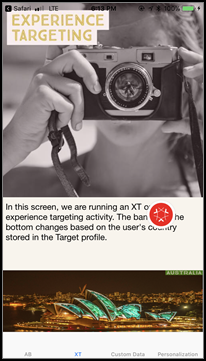

# [!DNL Target] mobiele voorvertoning

Met de koppelingen voor mobiele voorvertoningen kunt u eenvoudige end-to-end QA&#39;s voor mobiele toepassingsactiviteiten uitvoeren en uzelf zonder speciale testapparaten inschrijven voor verschillende ervaringen met uw apparaat.

Met de functie voor mobiele voorvertoningen kunt u uw activiteiten voor mobiele apps volledig testen voordat u deze live start.

## Vereisten

1. **Gebruik een ondersteunde versie van de SDK:** Voor de functie voor mobiele voorvertoningen moet u de juiste versie van de [!DNL Adobe Mobile SDK] in uw corresponderende apps.

   Voor instructies voor het downloaden van de juiste SDK raadpleegt u [Huidige SDK-versies](https://developer.adobe.com/client-sdks/documentation/current-sdk-versions/){target=_blank} in de *[!DNL Adobe Experience Platform Mobile SDK]* documentatie.

1. **Een URL-schema instellen:** De voorbeeldkoppeling gebruikt een URL-schema om uw app te openen. Geef een uniek URL-schema op voor de voorvertoning.

   Zie voor meer informatie [Visuele voorvertoning](https://developer.adobe.com/client-sdks/documentation/adobe-target/#visual-preview){target=_blank} in *De extensie Doel configureren in de gebruikersinterface voor gegevensverbinding* in de *[!DNL Mobile SDK]* documentatie.

   De volgende koppelingen bevatten meer informatie:

   * **iOs**: Ga voor meer informatie over het instellen van URL-schema&#39;s voor iOS naar [Een aangepast URL-schema voor uw app definiëren](https://developer.apple.com/documentation/xcode/defining-a-custom-url-scheme-for-your-app){target=_blank} op de *Apple Developer* website.
   * **Android**: Ga voor meer informatie over het instellen van URL-schema&#39;s voor Android naar [Diepe koppelingen maken naar App-inhoud](https://developer.android.com/training/app-links/deep-linking){target=_blank} op de *Android-ontwikkelaars* website.

1. **Stel de `collectLaunchInfo` API (alleen i0S)**

   Zie voor meer informatie [Visuele voorvertoning](https://developer.adobe.com/client-sdks/documentation/adobe-target/#visual-preview){target=_blank} in *De extensie Doel configureren in de gebruikersinterface voor gegevensverbinding* in de *[!DNL Mobile SDK]* documentatie.

## Een voorbeeldkoppeling genereren

1. In de [!DNL Target] UI, klik **[!UICONTROL More Options]** pictogram (de verticale ellips) en selecteer vervolgens **[!UICONTROL Create Mobile Preview Link]**.

   

1. Selecteer de activiteiten die u wilt voorvertonen en klik vervolgens op **[!UICONTROL Generate Mobile Preview Link]**.

   >[!NOTE]
   >
   >U kunt alleen op formulier gebaseerde [!UICONTROL A/B Test] en [!UICONTROL Experience Targeting] (XT) activiteiten.

   

1. Geef het URL-schema van uw app op.

   Het huidige URL-schema moet hetzelfde zijn als het schema dat aanwezig is in uw iOS- of Android-app. Herhaal dit proces indien nodig afzonderlijk voor iOS en Android.

   

1. Klikken **[!UICONTROL Generate Mobile Preview Link]** en kopieert u de koppeling.

   

## Voorvertonen op uw apparaat

Open de koppeling in een mobiele browser op een apparaat waarop uw app is geïnstalleerd. Deze app kan de productie-app zijn die u hebt gedownload van de [!DNL Apple App Store] of de [!DNL Google Play Store]. De app hoeft geen speciale build te zijn. Als u een actieve voorbeeldkoppeling hebt, kunt u de ervaringen op het apparaat bekijken.

1. Open de koppeling in uw mobiele browser.

   Deel de koppeling die u in de vorige sectie hebt gekopieerd vanuit de [!DNL Target] Op een handige manier gebruikersinterface naar uw mobiele apparaat gebruiken, bijvoorbeeld met tekst, e-mail of [!DNL Slack].

   |||

   Uw app wordt geopend en start de [!DNL Target] [!UICONTROL Mobile Preview Mode].

1. Selecteer de combinatie van ervaringen die u wilt zien en klik op **[!UICONTROL Launch Experiences]**.

   |||| ||||

## Beperkingen

* De nieuwe inhoud wordt pas na het dialoogvenster **[!UICONTROL Launch Experiences]** wordt geklikt. De eenvoudigste manier is om over te schakelen op een ander scherm en vervolgens terug te keren naar het scherm waar de wijziging naar verwachting zal plaatsvinden.
* Mobiele voorvertoning wordt niet ondersteund voor Android-versies ouder dan API-19 (KitKat).
