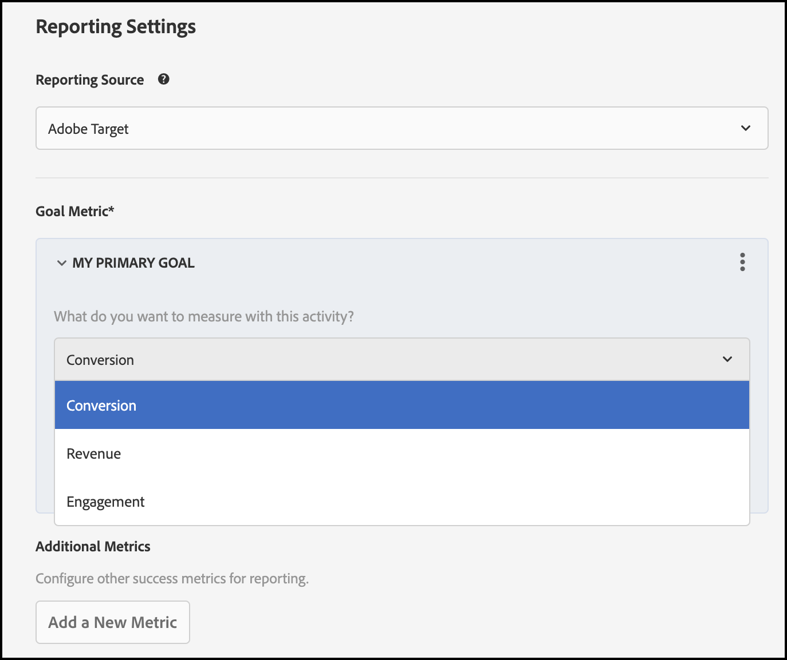

# Gebeurtenissen bijhouden

Gebruiken [!DNL Adobe Target]De mogelijkheden van het gebeurtenisvolgen om metriek effectief te meten die het belangrijkst voor uw zaken en gebruiksgevallen zijn. Het volgen van gebeurtenissen is essentieel om het succes van uw experimenteren of verpersoonlijkingsactiviteiten te meten, aangezien zij u vertellen welke variatie of ervaring het winnen of het verliezen is. Als u dit begrijpt, kunt u beter begrijpen hoe uw gebruikers uw product gebruiken of in een voortdurend veranderende omgeving evolueren.

Om gebeurtenissen via [!DNL Adobe Target]SDK&#39;s, volg dit proces in twee stappen:

1. SDK installeren en code implementeren die gebeurtenissen naar verzendt [!DNL Adobe Target].

1. Een [!DNL Adobe Target] activiteit met een doel metrisch in UI.

   

## Metriek en gebeurtenissen van het doel

In de volgende tabel wordt de combinatie van doelen en gebeurtenissen gedefinieerd die u met een [!DNL Target] activiteit met [!DNL Target]rapportagefuncties:

| Primair doel | Gebeurtenis |
| --- | --- |
| Conversie | Pagina&#39;s bekeken, een vak bekeken en op een vak geklikt |
| Ontvangsten | Een mbox bekeken en op mbox geklikt |
| Betrokkenheid | Paginaweergaven, klantscore en tijd op de site |

## Hoe impressies worden geactiveerd

Doel-SDK&#39;s roepen de onderliggende [Leverings-API](/help/dev/implement/delivery-api/overview.md). Wanneer een object execute met de vereiste parameters zich in het verzoek zelf bevindt, wordt de indruk voor kwalificerende activiteiten automatisch vergroot. De methodes van SDK die een indruk automatisch verhogen zijn:

* getOffers()
* getAttributes()

>[!NOTE]
>
>Wanneer een prefetch-object binnen de aanvraag wordt doorgegeven, wordt de indruk niet automatisch vergroot voor de activiteiten met vakken in het prefetch-object.

De `sendNotifications` kan worden gebruikt om gebeurtenissen handmatig te verzenden naar [!DNL Adobe Target] en geeft u een indruk.

>[!BEGINTABS]

>[!TAB Node.js]

```js {line-numbers="true"}
TargetClient.sendNotifications(options: Object): Promise
```

>[!TAB Java]

```java {line-numbers="true"}
ResponseStatus TargetClient.sendNotifications(TargetDeliveryRequest request)
```

>[!ENDTABS]

## Voorbeeldcode

De volgende codesteekproeven werken voor alle doel metrische types of het Conversie, Inkomsten of Betrokkenheid is.

### Een pagina of een box weergeven

In dit voorbeeld wordt eerst een aanbieding voor een doelbox gedaan met `getOffers`. Het bouwt dan een verzoek met een bericht dat op die mbox aanbieding wordt gebaseerd.

De kennisgeving `type` eigenschap is ingesteld op `display`.

Om aan te geven dat een pagina is weergegeven, is het belangrijk het adresobject op te geven in de berichtlading. Zorg ervoor dat u de URL overeenkomstig instelt.

Voor vakjes, moet u het mbox bezit op het berichtvoorwerp plaatsen en een serie tokens verstrekken die op de optiesserie in worden gebaseerd `targetResult`.

>[!BEGINTABS]

>[!TAB Node.js]

```js {line-numbers="true"}
const TargetClient = require("@adobe/target-nodejs-sdk");
const { v4: uuidv4 } = require("uuid");

const client = TargetClient.create({
  client: "acmeclient",
  organizationId: "1234567890@AdobeOrg",
  events: { clientReady: onTargetReady },
});

async function onTargetReady() {
  const targetResult = await client.getOffers({
    request: {
      targetRequest,
      prefetch: {
        mboxes: [
          {
            name: "homepage",
            index: 1
          }
        ]
      },
      sessionId: uuidv4()
    }
  });

  const { mboxes = [] } = targetResult.response.prefetch;

  const request = {
    context: { channel: "web" },
    notifications: mboxes.map(mbox => {
      const { options = [] } = mbox;

      return {
        id: targetResult.response.id,
        impressionId: uuidv4(),
        address: {
          url: "http://www.target-demo-site.com"
        },
        timestamp: new Date().getTime(),
        type: "display",
        mbox: {
          name: mbox.name
        },
        tokens: options.map(option => option.eventToken)
      };
    })
  };
  // send the notification event
  await client.sendNotifications({ request });
}
```

>[!TAB Java]

```java {line-numbers="true"}
ClientConfig clientConfig = ClientConfig.builder()
                .client("acmeclient")
                .organizationId("1234567890@AdobeOrg")
                .build();

TargetClient targetClient = TargetClient.create(clientConfig);

Context context = new Context()
        .channel(ChannelType.WEB)
        .address(new Address().url("http://www.target-demo-site.com"));

TargetDeliveryResponse targetResult = targetJavaClient.getOffers(TargetDeliveryRequest.builder()
        .context(context
        )
        .prefetch(new PrefetchRequest()
                .mboxes(new ArrayList() {{
                    add(new MboxRequest().name("homepage").index(1));
                }})
        )
        .build());

List<Notification> notifications = new ArrayList<>();
List<PrefetchMboxResponse> mboxes = targetResult.getResponse().getPrefetch().getMboxes();

for (PrefetchMboxResponse mbox : mboxes) {
    List<Option> options = mbox.getOptions();

    notifications.add((Notification) new Notification()
            .id(targetResult.getResponse().getRequestId())
            .impressionId(UUID.randomUUID().toString())
            .timestamp(System.currentTimeMillis())
            .type(MetricType.DISPLAY)
            .mbox(new NotificationMbox().name(mbox.getName()))
            .tokens(options.stream().map(Option::getEventToken).collect(Collectors.toList()))
            .address(new Address().url("http://www.target-demo-site.com"))
    );
}

TargetDeliveryRequest notificationRequest = TargetDeliveryRequest.builder()
        .context(context)
        .notifications(notifications).build();

targetJavaClient.sendNotifications(notificationRequest);
```

>[!ENDTABS]

### Op een box klikken

In dit voorbeeld wordt eerst een aanbieding voor een doelbox gedaan met `getOffers`. Het bouwt dan een verzoek met een bericht dat op die mbox aanbieding wordt gebaseerd.

De kennisgeving `type` eigenschap is ingesteld op `click`.

U moet de instelling `mbox` eigenschap op het meldingsobject en een array van tokens opgeven op basis van de metrieke-array in de `targetResult`.

>[!BEGINTABS]

>[!TAB Node.js]

```js {line-numbers="true"}
const TargetClient = require("@adobe/target-nodejs-sdk");
const { v4: uuidv4 } = require("uuid");

const client = TargetClient.create({
  client: "acmeclient",
  organizationId: "1234567890@AdobeOrg",
  events: { clientReady: onTargetReady },
});

async function onTargetReady() {
  const targetResult = await client.getOffers({
    request: {
      targetRequest,
      prefetch: {
        mboxes: [
          {
            name: "homepage",
            index: 1
          }
        ]
      },
      sessionId: uuidv4()
    }
  });

  const { mboxes = [] } = targetResult.response.prefetch;

  const request = {
    context: { channel: "web" },
    notifications: mboxes.map(mbox => {
      const { options = [], metrics = [] } = mbox;

      return {
        id: targetResult.response.id,
        impressionId: uuidv4(),
        address: {
          url: "http://www.target-demo-site.com"
        },
        timestamp: new Date().getTime(),
        type: "click",
        mbox: {
          name: mbox.name
        },
        tokens: metrics
                  .filter(metric => metric.type === "click")
                  .map(metric => metric.eventToken)
      };
    })
  };
  // send the notification event
  await client.sendNotifications({ request });
}
```

>[!TAB Java]

```java {line-numbers="true"}
ClientConfig clientConfig = ClientConfig.builder()
                .client("acmeclient")
                .organizationId("1234567890@AdobeOrg")
                .build();

TargetClient targetClient = TargetClient.create(clientConfig);

Context context = new Context()
        .channel(ChannelType.WEB)
        .address(new Address().url("http://www.target-demo-site.com"));

TargetDeliveryResponse targetResult = targetJavaClient.getOffers(TargetDeliveryRequest.builder()
        .context(context
        )
        .prefetch(new PrefetchRequest()
                .mboxes(new ArrayList() {{
                    add(new MboxRequest().name("homepage").index(1));
                }})
        )
        .build());

List<Notification> notifications = new ArrayList<>();
List<PrefetchMboxResponse> mboxes = targetResult.getResponse().getPrefetch().getMboxes();

for (PrefetchMboxResponse mbox : mboxes) {
    List<Metric> metrics = mbox.getMetrics();

    notifications.add((Notification) new Notification()
            .id(targetResult.getResponse().getRequestId())
            .impressionId(UUID.randomUUID().toString())
            .timestamp(System.currentTimeMillis())
            .type(MetricType.CLICK)
            .mbox(new NotificationMbox().name(mbox.getName()))
            .tokens(metrics.stream()
                    .filter(metric -> MetricType.CLICK.equals(metric.getType()))
                    .map(Metric::getEventToken)
                    .collect(Collectors.toList()))
            .address(new Address().url("http://www.target-demo-site.com"))
    );
}

TargetDeliveryRequest notificationRequest = TargetDeliveryRequest.builder()
        .context(context)
        .notifications(notifications).build();

targetJavaClient.sendNotifications(notificationRequest);
```

>[!ENDTABS]

### Weergave

Dit voorbeeld krijgt eerst doelweergaven met `getOffers`. Vervolgens wordt een aanvraag samengesteld met een melding op basis van die weergaven.

De kennisgeving `type` eigenschap is ingesteld op `display`.

Voor weergaven moet u de instelling `view` eigenschap op het meldingsobject en een array van tokens opgeven op basis van de optiesarray in de targetResult.

>[!BEGINTABS]

>[!TAB Node.js]

```js {line-numbers="true"}
const TargetClient = require("@adobe/target-nodejs-sdk");
const { v4: uuidv4 } = require("uuid");

const client = TargetClient.create({
  client: "acmeclient",
  organizationId: "1234567890@AdobeOrg",
  events: { clientReady: onTargetReady },
});

async function onTargetReady() {
  const targetResult = await client.getOffers({
    request: {
      targetRequest,
      prefetch: {
        views: [{}]
      },
      sessionId: uuidv4()
    }
  });

  const { views = [] } = targetResult.response.prefetch;

  const request = {
    context: { channel: "web" },
    notifications: views.map(view => {
      const { options = [], metrics = [] } = view;

      return {
        id: targetResult.response.id,
        impressionId: uuidv4(),
        address: {
          url: "http://www.target-demo-site.com"
        },
        timestamp: new Date().getTime(),
        type: "display",
        view: {
          name: view.name
        },
        tokens: options.map(option => option.eventToken)
      };
    })
  };
  // send the notification event
  await client.sendNotifications({ request });
}
```

>[!TAB Java]

```java {line-numbers="true"}
ClientConfig clientConfig = ClientConfig.builder()
                .client("acmeclient")
                .organizationId("1234567890@AdobeOrg")
                .build();

TargetClient targetClient = TargetClient.create(clientConfig);

Context context = new Context()
        .channel(ChannelType.WEB)
        .address(new Address().url("http://www.target-demo-site.com"));

TargetDeliveryResponse targetResult = targetJavaClient.getOffers(TargetDeliveryRequest.builder()
        .context(context)
        .prefetch(new PrefetchRequest()
                .views(new ArrayList() {{
                    add(new ViewRequest());
                }})
        )
        .build());

List<Notification> notifications = new ArrayList<>();
List<View> views = targetResult.getResponse().getPrefetch().getViews();

for (View view : views) {
    List<Option> options = view.getOptions();
    List<Metric> metrics = view.getMetrics();

    notifications.add((Notification) new Notification()
            .id(targetResult.getResponse().getRequestId())
            .impressionId(UUID.randomUUID().toString())
            .timestamp(System.currentTimeMillis())
            .type(MetricType.DISPLAY)
            .view(new NotificationView().name(view.getName()))
            .tokens(options.stream().map(Option::getEventToken).collect(Collectors.toList()))
            .address(new Address().url("http://www.target-demo-site.com"))
    );
}

TargetDeliveryRequest notificationRequest = TargetDeliveryRequest.builder()
        .context(context)
        .notifications(notifications).build();

targetJavaClient.sendNotifications(notificationRequest);
```

>[!ENDTABS]

### Klik op een weergave

Dit voorbeeld krijgt eerst doelweergaven met `getOffers`. Vervolgens wordt een aanvraag samengesteld met meldingen die op deze weergaven zijn gebaseerd.

De kennisgeving `type` eigenschap is ingesteld op `click`.

U moet de instelling `view` eigenschap op het meldingsobject en een array van tokens opgeven op basis van de metrieke-array in de targetResult.

>[!BEGINTABS]

>[!TAB Node.js]

```js {line-numbers="true"}
const TargetClient = require("@adobe/target-nodejs-sdk");
const { v4: uuidv4 } = require("uuid");

const client = TargetClient.create({
  client: "acmeclient",
  organizationId: "1234567890@AdobeOrg",
  events: { clientReady: onTargetReady },
});

async function onTargetReady() {
  const targetResult = await client.getOffers({
    request: {
      targetRequest,
      prefetch: {
        views: [{}]
      },
      sessionId: uuidv4()
    }
  });

  const { views = [] } = targetResult.response.prefetch;

  const request = {
    context: { channel: "web" },
    notifications: views.map(view => {
      const { options = [], metrics = [] } = view;

      return {
        id: targetResult.response.id,
        impressionId: uuidv4(),
        address: {
          url: "http://www.target-demo-site.com"
        },
        timestamp: new Date().getTime(),
        type: "click",
        view: {
          name: view.name
        },
        tokens: metrics
                  .filter(metric => metric.type === "click")
                  .map(metric => metric.eventToken)
      };
    })
  };
  // send the notification event
  await client.sendNotifications({ request });
}
```

>[!TAB Java]

```java {line-numbers="true"}
ClientConfig clientConfig = ClientConfig.builder()
                .client("acmeclient")
                .organizationId("1234567890@AdobeOrg")
                .build();

TargetClient targetClient = TargetClient.create(clientConfig);

Context context = new Context()
        .channel(ChannelType.WEB)
        .address(new Address().url("http://www.target-demo-site.com"));

TargetDeliveryResponse targetResult = targetJavaClient.getOffers(TargetDeliveryRequest.builder()
        .context(context)
        .prefetch(new PrefetchRequest()
                .views(new ArrayList() {{
                    add(new ViewRequest());
                }})
        )
        .build());

List<Notification> notifications = new ArrayList<>();
List<View> views = targetResult.getResponse().getPrefetch().getViews();

for (View view : views) {
    List<Option> options = view.getOptions();
    List<Metric> metrics = view.getMetrics();

    notifications.add((Notification) new Notification()
            .id(targetResult.getResponse().getRequestId())
            .impressionId(UUID.randomUUID().toString())
            .timestamp(System.currentTimeMillis())
            .type(MetricType.CLICK)
            .view(new NotificationView().name(view.getName()))
            .tokens(metrics.stream()
                    .filter(metric -> MetricType.CLICK.equals(metric.getType()))
                    .map(Metric::getEventToken)
                    .collect(Collectors.toList()))
            .address(new Address().url("http://www.target-demo-site.com"))
    );
}

TargetDeliveryRequest notificationRequest = TargetDeliveryRequest.builder()
        .context(context)
        .notifications(notifications).build();

targetJavaClient.sendNotifications(notificationRequest);
```

>[!ENDTABS]
