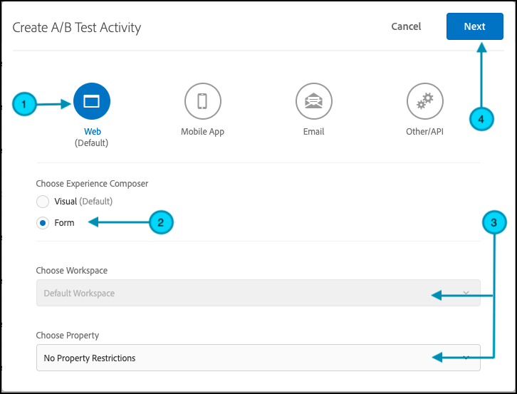
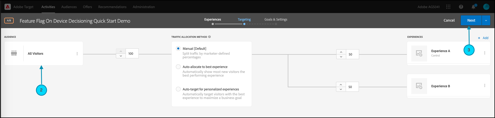

# Aan de slag met [!DNL Target] SDK&#39;s

We raden u aan om uw eerste [Apparaatbeslissingen](../on-device-decisioning/overview.md) de activiteit van de eigenschapmarkering in de taal van uw keus:

* Node.js
* Java
* .NET
* Python

## Overzicht van de stappen

1. Beslissing op het apparaat voor uw organisatie inschakelen
1. De SDK installeren
1. De SDK initialiseren
1. De functiemarkeringen instellen in een [!DNL Adobe Target] [!UICONTROL A/B Test] activiteit
1. De functie implementeren en renderen in uw toepassing
1. Bijhouden implementeren voor gebeurtenissen in uw toepassing
1. Activeer uw [!UICONTROL A/B Test] activiteit

## 1. Schakel apparaatbeslissingen in voor uw organisatie

Het toelaten van op apparaat beslist verzekert en [!UICONTROL A/B Test] activiteit wordt uitgevoerd bij bijna-nul latentie. Als u deze functie wilt inschakelen, navigeert u naar **[!UICONTROL Administration]** > **[!UICONTROL Implementation]** > **[!UICONTROL Account details]** en de **[!UICONTROL On-Device Decisioning]** schakelen.


>[!NOTE]
>
>U moet beschikken over **[!UICONTROL Admin]** of **[!UICONTROL Approver]** [gebruikersrol](https://experienceleague.adobe.com/docs/target/using/administer/manage-users/user-management.html) om de **[!UICONTROL On-Device Decisioning]** schakelen.

Nadat u het dialoogvenster **[!UICONTROL On-Device Decisioning]** schakelen, [!DNL Adobe Target] Beginnen met genereren [regelartefacten](../on-device-decisioning/rule-artifact-overview.md) voor uw client.

## 2. Installeer de SDK

Voor Node.js, Java, en Python, stel het volgende bevel in uw projectfolder in de terminal in werking. Voor .NET, voeg het als gebiedsdeel door toe [installeren vanaf NuGet](https://www.nuget.org/packages/Adobe.Target.Client).

>[!BEGINTABS]

>[!TAB Node.js (NPM)]

```js {line-numbers="true"}
npm i @adobe/target-nodejs-sdk -P
```

>[!TAB Java (Maven)]

```javascript {line-numbers="true"}
<dependency>
   <groupId>com.adobe.target</groupId>
   <artifactId>java-sdk</artifactId>
   <version>2.0</version>
</dependency>
```

>[!TAB .NET (Bash)]

```bash {line-numbers="true"}
dotnet add package Adobe.Target.Client
```

>[!TAB Python (pip)]

```python {line-numbers="true"}
pip install target-python-sdk
```

>[!ENDTABS]

## 3. Initialiseer de SDK

Het regelartefact wordt gedownload tijdens de de initialiseringsstap van SDK. U kunt de initialisatiestap aanpassen om te bepalen hoe het artefact wordt gedownload en gebruikt.

>[!BEGINTABS]

>[!TAB Node.js]

```js {line-numbers="true"}
const TargetClient = require("@adobe/target-nodejs-sdk");

const CONFIG = {
   client: "<your target client code>",
   organizationId: "your EC org id",
   decisioningMethod: "on-device",
   events: {
      clientReady: targetClientReady
      }
};

const tClient = TargetClient.create(CONFIG);

function targetClientReady() {
   //Adobe Target SDK has now downloaded the JSON artifact locally, which contains the activity details.
   //We will see how to use the artifact here very soon.
}
```

>[!TAB Java (Maven)]

```javascript {line-numbers="true"}
ClientConfig config = ClientConfig.builder()
   .client("testClient")
   .organizationId("ABCDEF012345677890ABCDEF0@AdobeOrg")
   .build();
TargetClient targetClient = TargetClient.create(config);
```

>[!TAB .NET (C#)]

```csharp {line-numbers="true"}
var targetClientConfig = new TargetClientConfig.Builder("testClient", "ABCDEF012345677890ABCDEF0@AdobeOrg")
   .Build();
this.targetClient.Initialize(targetClientConfig);
```

>[!TAB Python]

```python {line-numbers="true"}
from target_python_sdk import TargetClient

def target_client_ready():
   # Adobe Target SDK has now downloaded the JSON artifact locally, which contains the activity details.
   # We will see how to use the artifact here very soon.

CONFIG = {
   "client": "<your target client code>",
   "organization_id": "your EC org id",
   "decisioning_method": "on-device",
   "events": {
      "client_ready": target_client_ready
   }
}

target_client = TargetClient.create(CONFIG)
```

>[!ENDTABS]

## 4. Stel de functiemarkeringen in een [!DNL Adobe Target] [!UICONTROL A/B Test] activiteit

1. In [!DNL Target], navigeert u naar de **[!UICONTROL Activities]** pagina, selecteert u vervolgens **[!UICONTROL Create Activity]** > **[!UICONTROL A/B test]**.

   

1. In de **[!UICONTROL Create A/B Test Activity]** modaal, verlaat de standaardoptie van het Web geselecteerd (1), selecteer **[!UICONTROL Form]** als uw ervaringscomposer (2), selecteert u **[!UICONTROL Default Workspace]** with **[!UICONTROL No Property Restrictions]**(3) en klikt u vervolgens op **[!UICONTROL Next]** (4)

   

1. In de **[!UICONTROL Experiences]** stap voor het maken van activiteiten, geef een naam voor uw activiteit (1) en voeg een tweede ervaring toe, Experience B, door op **[!UICONTROL Add Experience]** (2) Voer de locatienaam van uw keuze in (3). Bijvoorbeeld: `ondevice-featureflag` of `homepage-addtocart-featureflag` zijn plaatsnamen die op de bestemmingen voor het testen van de eigenschapvlag wijzen.  In het onderstaande voorbeeld: `ondevice-featureflag` Dit is de locatie die is gedefinieerd voor Ervaring B. U kunt ook Verfijningen van publiek toevoegen (4) om de kwalificatie te beperken tot de activiteit.

   

1. In de **[!UICONTROL CONTENT]** op dezelfde pagina selecteert u **[!UICONTROL Create JSON Offer]** in de vervolgkeuzelijst (1), zoals weergegeven.

   

1. In de **[!UICONTROL JSON Data]** in het tekstvak dat wordt weergegeven, typt u de variabelen voor de functiemarkering voor elke ervaring (1) met een geldig JSON-object (2).

   Voer de kenmerkmarkeringsvariabelen voor Experience A in.

   

   **(Voorbeeld van JSON voor Experience A, hierboven)**

   ```json {line-numbers="true"}
   {
      "enabled" : true,
      "flag" : "expA"
   }
   ```

   Voer de variabelen voor de functiemarkering in voor Experience B.

   

   **(Voorbeeld van JSON voor Experience B, hierboven)**

   ```json {line-numbers="true"}
   {
      "enabled" : true,
      "flag" : "expB"
   }
   ```

1. Klikken **[!UICONTROL Next]** (1) aan de **[!UICONTROL Targeting]** stap van het creëren van activiteit.

   

1. In de **[!UICONTROL Targeting]** In het volgende stapvoorbeeld blijft Audience Targeting (2) voor de eenvoud de standaardset met Alle bezoekers. Dit betekent dat de activiteit niet gericht is. Nota Adobe adviseert u altijd uw publiek voor productieactiviteiten richten. Klikken **[!UICONTROL Next]** (3) aan de **[!UICONTROL Goals & Settings]** stap van het creëren van activiteit.

   

1. In de **[!UICONTROL Goals & Settings]** stap, instellen **[!UICONTROL Reporting Source]** tot **[!UICONTROL Adobe Target]** (1) Definieer de **[!UICONTROL Goal Metric]** als **[!UICONTROL Conversion]**, waarbij u de details opgeeft op basis van de omzettingscijfers van uw site (2). Klikken **[!UICONTROL Save & Close]** (3) om de activiteit op te slaan.

   

## 5. Implementeer en rendeer de functie in uw toepassing

Na het instellen van de kenmerkmarkeringsvariabelen in [!DNL Target]wijzigt u de toepassingscode om deze te gebruiken. Nadat u bijvoorbeeld de functiemarkering in de toepassing hebt opgehaald, kunt u deze gebruiken om functies in te schakelen en de ervaring weer te geven waarvoor de bezoeker gekwalificeerd was.

>[!BEGINTABS]

>[!TAB Node.js]

```js {line-numbers="true"}
//... Code removed for brevity
​
let featureFlags = {};
​
function targetClientReady() {
   tClient.getAttributes(["ondevice-featureflag"]).then(function(response) {
      const featureFlags = response.asObject("ondevice-featureflag");
      if(featureFlags.enabled && featureFlags.flag !== "expA") { //Assuming "expA" is control
         console.log("Render alternate experience" + featureFlags.flag);
      }
      else {
         console.log("Render default experience");
      }
   });
}
```

>[!TAB Java (Maven)]

```javascript {line-numbers="true"}
MboxRequest mbox = new MboxRequest().name("ondevice-featureflag").index(0);
TargetDeliveryRequest request = TargetDeliveryRequest.builder()
   .context(new Context().channel(ChannelType.WEB))
   .execute(new ExecuteRequest().mboxes(Arrays.asList(mbox)))
   .build();
Attributes attributes = targetClient.getAttributes(request, "ondevice-featureflag");
String flag = attributes.getString("ondevice-featureflag", "flag");
```

>[!TAB .NET (C#)]

```csharp {line-numbers="true"}
var mbox = new MboxRequest(index: 0, name: "ondevice-featureflag");
var deliveryRequest = new TargetDeliveryRequest.Builder()
   .SetContext(new Context(ChannelType.Web))
   .SetExecute(new ExecuteRequest(mboxes: new List<MboxRequest> { mbox }))
   .Build();
var attributes = targetClient.GetAttributes(request, "ondevice-featureflag");
var flag = attributes.GetString("ondevice-featureflag", "flag");
```

>[!TAB Python]

```python {line-numbers="true"}
# ... Code removed for brevity

feature_flags = {}

def target_client_ready():
   attribute_provider = target_client.get_attributes(["ondevice-featureflag"])
   feature_flags = attribute_provider.as_object(mbox_name="ondevice-featureflag")
   if feature_flags.get("enabled") and feature_flags.get("flag") != "expA": # Assuming "expA" is control
      print("Render alternate experience {}".format(feature_flags.get("flag")))
   else:
      print("Render default experience")
```

>[!ENDTABS]

## 6. Extra tracering implementeren voor gebeurtenissen in uw toepassing

U kunt desgewenst aanvullende gebeurtenissen voor het bijhouden van conversies verzenden met de functie sendNotification().

>[!BEGINTABS]

>[!TAB Node.js]

```js {line-numbers="true"}
//... Code removed for brevity
​
//When a conversion happens
TargetClient.sendNotifications({
   targetCookie,
   "request" : {
      "notifications" : [
      {
         type: "display",
         timestamp : Date.now(),
         id: "conversion",
         mbox : {
            name : "orderConfirm"
         },
         order : {
            id: "BR9389",
            total : 98.93,
            purchasedProductIds : ["J9393", "3DJJ3"]
         }
      }
      ]
   }
})
```

>[!TAB Java (Maven)]

```javascript {line-numbers="true"}
Notification notification = new Notification();
notification.setId("conversion");
notification.setImpressionId(UUID.randomUUID().toString());
notification.setType(MetricType.DISPLAY);
notification.setTimestamp(System.currentTimeMillis());
Order order = new Order("BR9389");
order.total(98.93);
order.purchasedProductIds(["J9393", "3DJJ3"]);
notification.setOrder(order);

TargetDeliveryRequest notificationRequest =
   TargetDeliveryRequest.builder()
      .context(new Context().channel(ChannelType.WEB))
      .notifications(Collections.singletonList(notification))
      .build();

NotificationDeliveryService notificationDeliveryService = new NotificationDeliveryService();
notificationDeliveryService.sendNotification(notificationRequest);
```

>[!TAB .NET (C#)]

```csharp {line-numbers="true"}
var order = new Order
{
   Id = "BR9389",
   Total = 98.93M,
   PurchasedProductIds = new List<string> { "J9393", "3DJJ3" },
};
​
var notification = new Notification
{
   Id = "conversion",
   ImpressionId = Guid.NewGuid().ToString(),
   Type = MetricType.Display,
   Timestamp = DateTimeOffset.UtcNow.ToUnixTimeMilliseconds(),
   Order = order,
};
​
var notificationRequest = new TargetDeliveryRequest.Builder()
   .SetContext(new Context(ChannelType.Web))
   .SetNotifications(new List<Notification> {notification})
   .Build();
​
targetClient.SendNotifications(notificationRequest);
```

>[!TAB Python]

```python {line-numbers="true"}
# ... Code removed for brevity

# When a conversion happens
notification_mbox = NotificationMbox(name="orderConfirm")
order = Order(id="BR9389, total=98.93, purchased_product_ids=["J9393", "3DJJ3"])
notification = Notification(
   id="conversion",
   type=MetricType.DISPLAY,
   timestamp=1621530726000,  # Epoch time in milliseconds
   mbox=notification_mbox,
   order=order
)
notification_request = DeliveryRequest(notifications=[notification])


target_client.send_notifications({
   "target_cookie": target_cookie,
   "request" : notification_request
})
```

>[!ENDTABS]

## 7. Activeer uw [!UICONTROL A/B Test] activiteit

1. Klikken **[!UICONTROL Activate]** (1) om uw [!UICONTROL A/B Test] activiteit.

   >[!NOTE]
   >
   >U moet beschikken over **[!UICONTROL Approver]** of **[!UICONTROL Publisher]** [gebruikersrol](https://experienceleague.adobe.com/docs/target/using/administer/manage-users/user-management.html) om deze stap uit te voeren.

   
