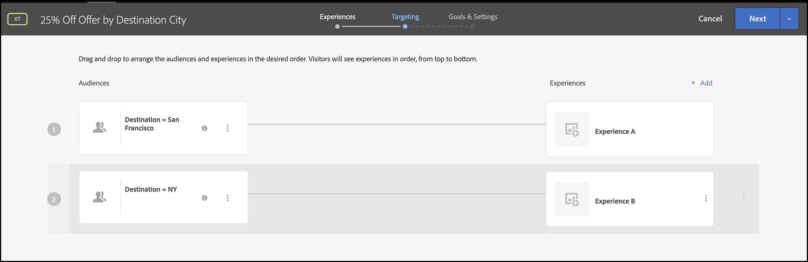

# Leveren personalisatie

## Overzicht van de stappen

1. Inschakelen [!UICONTROL on-device decisioning] voor uw organisatie
1. Een [!UICONTROL Experience Targeting] (XT) activiteit
1. Een persoonlijke ervaring definiëren per publiek
1. Verifieer persoonlijke ervaring per publiek
1. Rapportage instellen
1. Metriek toevoegen voor het bijhouden van KPI&#39;s
1. Aangepaste aanbiedingen implementeren in uw toepassing
1. Code implementeren om conversiegebeurtenissen bij te houden
1. Activeer uw [!UICONTROL Experience Targeting] (XT) personaliseringsactiviteit

Stel dat je een rondvaartbedrijf bent. U wilt een persoonlijk aanbod van 25% van bepaalde reispakketten aanbieden. Als u wilt dat de aanbieding op uw gebruikers wordt afgestemd, kiest u ervoor een landmerk van de bestemmingsstad weer te geven. U wilt er ook voor zorgen dat de levering van uw gepersonaliseerde aanbiedingen wordt uitgevoerd met een latentie van bijna nul, zodat dit geen negatieve invloed heeft op de ervaringen van gebruikers en de resultaten niet scheeftrekt.

## 1. Inschakelen [!UICONTROL on-device decisioning] voor uw organisatie

1. Het toelaten van op-apparatenbesluit verzekert een activiteit A/B bij bijna-nul latentie wordt uitgevoerd. Als u deze functie wilt inschakelen, navigeert u naar **[!UICONTROL Administration]** > **[!UICONTROL Implementation]** > **[!UICONTROL Account details]** in [!DNL Adobe Target]en de **[!UICONTROL On-Device Decisioning]** schakelen.

   

   >[!NOTE]
   >
   >U moet de beheerder of fiatteur hebben [gebruikersrol](https://experienceleague.adobe.com/docs/target/using/administer/manage-users/user-management.html?lang=nl-NL) om de [!UICONTROL On-Device Decisioning] schakelen.

   Nadat u het dialoogvenster **[!UICONTROL On-Device Decisioning]** schakelen, [!DNL Adobe Target] Beginnen met genereren *regelartefacten* voor uw client.

## 2. Maak een [!UICONTROL Experience Targeting] (XT) activiteit

1. In [!DNL Adobe Target], navigeert u naar de **[!UICONTROL Activities]** pagina, selecteert u vervolgens **[!UICONTROL Create Activity]** > **[!UICONTROL Experience Targeting]**.

   

1. In de **[!UICONTROL Create Experience Targeting Activity]** modaal, verlaat het gebrek **[!UICONTROL Web]** geselecteerd (1), selecteert u **[!UICONTROL Form]** als uw ervaringscomposer (2), selecteer een werkruimte en een bezit (3), en klik **[!UICONTROL Next]** (4)

   

## 3. Een persoonlijke ervaring per publiek definiëren

1. In de **[!UICONTROL Experiences]** stap maken van activiteit, klik op **[!UICONTROL Change Audience]** om een publiek te creëren van die bezoekers die naar San Francisco, Californië willen reizen.

   

1. In de **[!UICONTROL Create Audience]** modal, een aangepaste regel definiëren waarbij `destinationCity = San Francisco`. Dit bepaalt de groep gebruikers die naar San Francisco willen reizen.

   

1. Nog steeds in de **[!UICONTROL Experiences]** Voer de naam in van de locatie (1) in uw toepassing waar u een speciale aanbieding wilt weergeven met betrekking tot de Gulden Gate Bridge, maar alleen voor diegenen die naar San Francisco gaan. In het hier weergegeven voorbeeld is homepage de locatie die is geselecteerd voor de HTML-aanbieding (2), die wordt gedefinieerd in het dialoogvenster **[!UICONTROL Content]** gebied.

   

1. Nog een doelgroep toevoegen door te klikken **[!UICONTROL Add Experience Targeting]**. Deze keer richt zich op een publiek dat naar New York wil reizen door een publieksregel te definiëren waar `destinationCity = New York`. Bepaal de plaats binnen uw toepassing waar u een speciale aanbieding betreffende het Lege Bouwwerk van de Staat wilt teruggeven. In het hier weergegeven voorbeeld: `homepage` is de locatie die is geselecteerd voor de HTML-aanbieding (2), die wordt gedefinieerd in de **[!UICONTROL Content]** gebied.

   

## 4. Verifieer persoonlijke ervaring per publiek

In de **[!UICONTROL Targeting]** stap, verifieer u de gewenste gepersonaliseerde ervaring per publiek hebt gevormd.



## 5. Rapportage instellen

In de **[!UICONTROL Goals & Settings]** stap, kies **[!UICONTROL Adobe Target]** als de **[!UICONTROL Reporting Source]** om de resultaten van de activiteit in [!DNL Adobe Target] UI of kies **[!UICONTROL Adobe Analytics]** om deze weer te geven in de gebruikersinterface van Adobe Analytics.


## 6. Metrische gegevens toevoegen voor het bijhouden van KPI&#39;s

Kies een **[!UICONTROL Goal Metric]** om het succes van de activiteit te meten. In dit voorbeeld, is een succesvolle omzetting gebaseerd op of de gebruiker op de gepersonaliseerde bestemmingsaanbieding klikt.

## 7. Implementeer uw persoonlijke aanbiedingen in uw toepassing

>[!BEGINTABS]

>[!TAB Node.js]

```js {line-numbers="true"}
const TargetClient = require("@adobe/target-nodejs-sdk");

const CONFIG = {
  client: "acmeclient",
  organizationId: "1234567890@AdobeOrg"
};

const targetClient = TargetClient.create(CONFIG);

targetClient.getOffers({
  request: {      
    execute: {
      pageLoad: {
        parameters: {
          destinationCity: "San Francisco"
        }
      }
    }       
  }
})
.then(console.log)
.catch(console.error);
```

>[!TAB Java]

```java {line-numbers="true"}
ClientConfig config = ClientConfig.builder()
  .client("acmeclient")
  .organizationId("1234567890@AdobeOrg")
  .build();
TargetClient targetClient = TargetClient.create(config);

Context context = new Context().channel(ChannelType.WEB);

ExecuteRequest executeRequest = new ExecuteRequest();

RequestDetails pageLoad = new RequestDetails();
pageLoad.setParameters(
    new HashMap<String, String>() {
      {
        put("destinationCity", "San Francisco");
      }
    });

executeRequest.setPageLoad(pageLoad);

TargetDeliveryRequest request = TargetDeliveryRequest.builder()
  .context(context)
  .execute(executeRequest)
  .build();

TargetDeliveryResponse offers = targetClient.getOffers(request);
```

>[!ENDTABS]

## 8. Code implementeren om conversiegebeurtenissen bij te houden

>[!BEGINTABS]

>[!TAB Node.js]

```js {line-numbers="true"}
//... Code removed for brevity

//When a conversion happens
TargetClient.sendNotifications({
    targetCookie,
    "request" : {
      "notifications" : [
        {
          type: "click",
          timestamp : Date.now(),
          id: "conversion",
          mbox : {
            name : "destinationOffer"
          }
        }
      ]
    }
})
```

>[!TAB Java]

```java {line-numbers="true"
ClientConfig config = ClientConfig.builder()
  .client("acmeclient")
  .organizationId("1234567890@AdobeOrg")
  .build();
TargetClient targetClient = TargetClient.create(config);

Context context = new Context().channel(ChannelType.WEB);

ExecuteRequest executeRequest = new ExecuteRequest();

RequestDetails pageLoad = new RequestDetails();
pageLoad.setParameters(
    new HashMap<String, String>() {
      {
        put("destinationCity", "San Francisco");
      }
    });

executeRequest.setPageLoad(pageLoad);
NotificationDeliveryService notificationDeliveryService = new NotificationDeliveryService();

Notification notification = new Notification();
notification.setId("conversion");
notification.setImpressionId(UUID.randomUUID().toString());
notification.setType(MetricType.CLICK);
notification.setTimestamp(System.currentTimeMillis());
notification.setTokens(
    Collections.singletonList(
        "IbG2Jz2xmHaqX7Ml/YRxRGqipfsIHvVzTQxHolz2IpSCnQ9Y9OaLL2gsdrWQTvE54PwSz67rmXWmSnkXpSSS2Q=="));

TargetDeliveryRequest targetDeliveryRequest =
    TargetDeliveryRequest.builder()
        .context(context)
        .execute(executeRequest)
        .notifications(Collections.singletonList(notification))
        .build();

TargetDeliveryResponse offers = targetClient.getOffers(request);
notificationDeliveryService.sendNotification(request);
```

>[!ENDTABS]

## 9. Activeer uw Experience Targeting (XT)-activiteit


