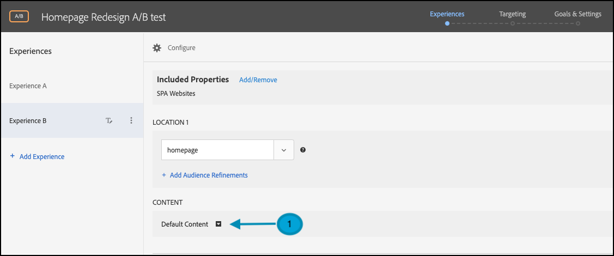
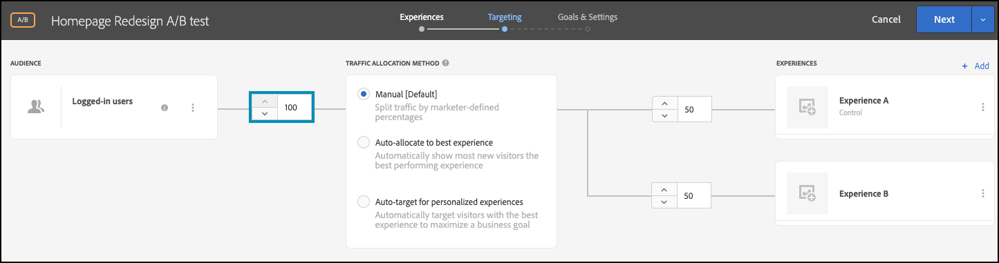

# A/B-tests uitvoeren met functiemarkeringen

## Overzicht van de stappen

1. Inschakelen [!UICONTROL on-device decisioning] voor uw organisatie
1. Een [!UICONTROL A/B Test] activiteit
1. Geef uw A en B op
1. Een publiek toevoegen
1. Verkeerstoewijzing instellen
1. Verkeersdistributie instellen op variaties
1. Rapportage instellen
1. Metriek toevoegen voor het bijhouden van KPI&#39;s
1. Code implementeren om A/B-tests uit te voeren met functiemarkeringen
1. Uw A/B-test activeren met functiemarkeringen

>[!NOTE]
>
>Stel dat u wilt bepalen of uw herontwerp van uw homepage met betrekking tot uw herfstthema goed door uw gebruikers zou worden ontvangen. U besluit het te testen door een A/B-experiment uit te voeren in [!DNL Adobe Target]. U wilt er ook voor zorgen dat het experiment wordt uitgevoerd met goede prestaties, zodat een negatieve of trage gebruikerservaring de resultaten niet scheeftrekt.

## 1. Inschakelen [!UICONTROL on-device decisioning] voor uw organisatie

Het toelaten van op-apparatenbesluit verzekert een activiteit A/B bij bijna-nul latentie wordt uitgevoerd. Als u deze functie wilt inschakelen, navigeert u naar **[!UICONTROL Administration]** > **[!UICONTROL Implementation]** > **[!UICONTROL Account details]** in [!DNL Adobe Target]en de **[!UICONTROL On-Device Decisioning]** schakelen.

&lt;!— Afbeelding odd4.png invoegen —>


>[!NOTE]
>
>U moet de beheerder of fiatteur hebben [gebruikersrol](https://experienceleague.adobe.com/docs/target/using/administer/manage-users/user-management.html) om de beslissingstoegang op het apparaat in of uit te schakelen.

Nadat u het dialoogvenster **[!UICONTROL On-Device Decisioning]** schakelen, [!DNL Adobe Target] begint regelartefacten voor uw cliënt te produceren.

## 2. Maak een [!UICONTROL A/B Test] activiteit

In [!DNL Adobe Target], navigeert u naar de **[!UICONTROL Activities]** pagina, selecteert u vervolgens **[!UICONTROL Create Activity]** > **[!UICONTROL A/B test]**.


In de **[!UICONTROL Create A/B Test Activity]** modaal, verlaat het gebrek **[!UICONTROL Web]** geselecteerd (1), selecteert u **[!UICONTROL Form]** als uw ervaringscomposer (2), selecteert u **[!UICONTROL Default Workspace]** Met Nee **[!UICONTROL Property Restrictions]** (3) en klikt u op **[!UICONTROL Next]** (4)


## 3. Definieer uw A en B

1. In de **[!UICONTROL Experiences]** stap voor het maken van activiteiten, geef een naam op voor uw activiteit (1) en voeg een tweede ervaring toe, Experience B, door op de knop **[!UICONTROL Add Experience]** (2). Voer de naam in van de locatie (3) in uw toepassing waar u de A/B-test wilt uitvoeren. In het onderstaande voorbeeld is homepage de locatie die is gedefinieerd voor Experience A. (Dit is ook de locatie die is gedefinieerd voor Experience B.)

   De ervaring A bepaalt de controle, die het huidige homepage ontwerp is.

   

   Ervaring B definieert de uitdager, die een herontworpen homepage zal vertegenwoordigen. Klik om de standaardinhoud te wijzigen (1).

   

1. Klik in Experience B om de inhoud te wijzigen vanuit **[!UICONTROL Default Content]** naar de opnieuw ontworpen inhoud door **[!UICONTROL Create JSON Offer]** zoals hieronder aangegeven (1).

   

1. Bepaal JSON met attributen die als vlaggen zullen worden gebruikt om uw bedrijfslogica toe te laten om de nieuw herontworpen homepage, eerder dan de huidige homepage in productie terug te geven.


   >[!NOTE]
   >
   >Wanneer [!DNL Adobe Target] emmert een gebruiker om Ervaring B (de opnieuw ontworpen homepage) te zien, JSON met de attributen die in het voorbeeld worden bepaald zal zijn teruggekeerd. In uw code, zult u de attributenwaarden moeten controleren om te beslissen of om de bedrijfslogica uit te voeren om de opnieuw ontworpen homepage terug te geven. In dit JSON-antwoord kunt u namen, waarden en het aantal kenmerken definiëren.

   

## 4. Voeg een publiek toe

Veronderstel u het nieuwe ontwerp op uw loyale klanten wilt eerst testen, die u zich gebaseerd op kunt identificeren of zij al dan niet worden het programma geopend.

1. In de **[!UICONTROL Targeting]** stap, klik om de **[!UICONTROL All Visitors]** publiek, zoals getoond.

   

1. In de **[!UICONTROL Create Audience]** modal, een aangepaste regel definiëren waarbij `logged-in = true`. Hiermee definieert u de groep gebruikers die zijn aangemeld. Gebruik dit publiek in uw activiteit.

   

## 5. Verkeerstoewijzing instellen

Bepaal het percentage van uw het programma geopende gebruikers waartegen u uw nieuwe homepage wilt testen herontwerpen. Met andere woorden, aan welk percentage van uw gebruikers wilt u deze test uitvoeren? In dit voorbeeld, om deze test aan alle het programma geopende gebruikers op te stellen, houd de verkeerstoewijzing bij 100%.



## 6. Verkeersdistributie instellen op variaties

Bepaal het percentage van uw het programma geopende gebruikers die het huidige ontwerp van de homepage of volledig nieuw nieuw ontwerp zullen zien. In dit voorbeeld, houd de verkeersdistributie als 50/50 verdeling tussen Ervaringen A en B.


## 7. Rapportage instellen

In de **[!UICONTROL Goals & Settings]** stap, kies **[!UICONTROL Adobe Target]** als de **[!UICONTROL Reporting Source]** om de resultaten van de activiteit in [!DNL Adobe Target] UI of kies **[!UICONTROL Adobe Analytics]** om deze weer te geven in de gebruikersinterface van Adobe Analytics.


## 8. Metriek toevoegen voor het bijhouden van KPI&#39;s

Kies een **[!UICONTROL Goal Metric]** om de A/B-test te meten. In dit voorbeeld is een geslaagde conversie gebaseerd op het feit of de gebruiker de onderkant van de pagina bereikt, wat de betrokkenheid aangeeft. Daarom **[!UICONTROL Conversion]** wordt bepaald op basis van het feit of de gebruiker de locatie onder aan de pagina heeft weergegeven.

## 9. Code implementeren om A/B-tests met functiemarkeringen uit te voeren in uw toepassing

>[!BEGINTABS]

>[!TAB Node.js]

```js {line-numbers="true"}
const TargetClient = require("@adobe/target-nodejs-sdk");
const options = {
  client: "testClient",
  organizationId: "ABCDEF012345677890ABCDEF0@AdobeOrg",
  decisioningMethod: "on-device",
  events: {
    clientReady: targetClientReady
  }
};
const targetClient = TargetClient.create(options);

function targetClientReady() {
  return targetClient.getAttributes(["homepage"]).then(function(attributes) {
    const flag = attributes.getValue("homepage", "feature-flag");
    // ...
  });
}
```

>[!TAB Java]

```java {line-numbers="true"}
import com.adobe.target.edge.client.ClientConfig;
import com.adobe.target.edge.client.TargetClient;
import com.adobe.target.delivery.v1.model.ChannelType;
import com.adobe.target.delivery.v1.model.Context;
import com.adobe.target.delivery.v1.model.ExecuteRequest;
import com.adobe.target.delivery.v1.model.MboxRequest;
import com.adobe.target.edge.client.entities.TargetDeliveryRequest;
import com.adobe.target.edge.client.model.TargetDeliveryResponse;

ClientConfig config = ClientConfig.builder()
    .client("testClient")
    .organizationId("ABCDEF012345677890ABCDEF0@AdobeOrg")
    .build();
TargetClient targetClient = TargetClient.create(config);
MboxRequest mbox = new MboxRequest().name("homepage").index(0);
TargetDeliveryRequest request = TargetDeliveryRequest.builder()
    .context(new Context().channel(ChannelType.WEB))
    .execute(new ExecuteRequest().mboxes(Arrays.asList(mbox)))
    .build();
Attributes attributes = targetClient.getAttributes(request, "homepage");
String flag = attributes.getString("homepage", "feature-flag");
```

>[!ENDTABS]

## 10. Activeer uw A/B-test met markering voor functies


