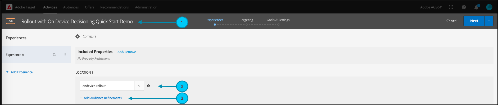

# Rolouts voor functietests beheren

## Overzicht van de stappen

1. Inschakelen [!UICONTROL on-device decisioning] voor uw organisatie
1. Een [!UICONTROL A/B Test] activiteit
1. Definieer de functie- en rollout-instellingen
1. De functie implementeren en renderen in uw toepassing
1. Bijhouden implementeren voor gebeurtenissen in uw toepassing
1. Uw A/B-activiteit activeren
1. Pas rollout en verkeerstoewijzing zonodig aan

## 1. Inschakelen [!UICONTROL on-device decisioning] voor uw organisatie

Het toelaten van op-apparatenbesluit verzekert een activiteit A/B bij bijna-nul latentie wordt uitgevoerd. Als u deze functie wilt inschakelen, navigeert u naar **[!UICONTROL Administration]** > **[!UICONTROL Implementation]** > **[!UICONTROL Account details]** in [!DNL Adobe Target]en de **[!UICONTROL On-Device Decisioning]** schakelen.


>[!NOTE]
>
>U moet de beheerder of fiatteur hebben [gebruikersrol](https://experienceleague.adobe.com/docs/target/using/administer/manage-users/user-management.html?lang=nl-NL) om de [!UICONTROL On-Device Decisioning] schakelen.

Nadat u het dialoogvenster [!UICONTROL On-Device Decisioning] schakelen, [!DNL Adobe Target] Beginnen met genereren *regelartefacten* voor uw client.

## 2. Maak een [!UICONTROL A/B Test] activiteit

1. In [!DNL Adobe Target], navigeert u naar de **[!UICONTROL Activities]** pagina, selecteert u vervolgens **[!UICONTROL Create Activity]** > **[!UICONTROL A/B test]**.

   

1. In de **[!UICONTROL Create A/B Test Activity]** modaal, verlaat het gebrek **[!UICONTROL Web]** geselecteerd (1), selecteert u **[!UICONTROL Form]** als uw ervaringscomposer (2), selecteert u **[!UICONTROL Default Workspace]** with **[!UICONTROL No Property Restrictions]** (3) en klikt u op **[!UICONTROL Next]** (4)

   

## 3. Definieer de functie- en rollout-instellingen

In de **[!UICONTROL Experiences]** Voer een naam in voor uw activiteit (1). Voer de naam in van de locatie (2) in de toepassing waar u de rollouts voor de functie wilt beheren. Bijvoorbeeld:  `ondevice-rollout` of `homepage-addtocart-rollout` zijn plaatsnamen die op de bestemmingen voor het beheren van eigenschaprollouts wijzen. In het onderstaande voorbeeld: `ondevice-rollout` is de locatie die is gedefinieerd voor Experience A. U kunt de verfijningen van het publiek (4) naar keuze toevoegen om kwalificatie tot de activiteit te beperken.



1. In de **[!UICONTROL Content]** op dezelfde pagina selecteert u **[!UICONTROL Create JSON Offer]** in de vervolgkeuzelijst (1), zoals weergegeven.

   

1. In de **[!UICONTROL JSON Data]** in het tekstvak dat wordt weergegeven, typt u met een geldig JSON-object (2) de variabele met de eigenschapmarkering voor de functie die u met deze activiteit wilt uitvoeren.

   

1. Klikken **[!UICONTROL Next]** (1) aan de **[!UICONTROL Targeting]** stap van het creëren van activiteit.

   

1. In de **[!UICONTROL Targeting]** stap, de **[!UICONTROL All Visitors]** publiek (1), voor eenvoud. Maar pas de verkeerstoewijzing (2) aan 10% aan. Hierdoor wordt de functie beperkt tot slechts 10% van de bezoekers van de site. Klik op Volgende (3) om naar de **[!UICONTROL Goals & Settings]** stap.

   

1. In de **[!UICONTROL Goals & Settings]** stap, kies **[!UICONTROL Adobe Target]** (1) als de **[!UICONTROL Reporting Source]** om de resultaten van je activiteiten te bekijken in het dialoogvenster [!DNL Adobe Target] UI.

1. Kies een **[!UICONTROL Goal Metric]** om de activiteit te meten. In dit voorbeeld is een geslaagde conversie gebaseerd op het feit of de gebruiker een item aanschaft, zoals wordt aangegeven door of de gebruiker de locatie orderConfirm (2) heeft bereikt.

1. Klikken **[!UICONTROL Save & Close]** (3) om de activiteit op te slaan.

   

## 4. Implementeer en rendeer de functie in uw toepassing

>[!BEGINTABS]

>[!TAB Node.js]

```js {line-numbers="true"}
targetClient.getAttributes(["ondevice-rollout"]).then(function(attributes) {
      const featureFlags = attributes.asObject("ondevice-rollout");

      // Your flag variables are now available in the featureFlags object variable.
      //If you failed to qualify for the Activity, you will have an empty object.
      console.log(featureFlags);
    });
```

>[!TAB Java]

```java {line-numbers="true"}
    Attributes attrs = targetJavaClient.getAttributes(targetDeliveryRequest, "ondevice-rollout");
    Map<String, Object> featureFlags = attrs.toMboxMap("ondevice-rollout");
​
    // Your flag variables are now available in the featureFlags object variable.
    //If you failed to qualify for the Activity, you will have an empty object.
    System.out.println(featureFlags);
```

>[!ENDTABS]

## 5. Implementeer tracering voor gebeurtenissen in uw toepassing

Nadat u de variabele met de functiemarkering beschikbaar hebt gemaakt in de toepassing, kunt u deze gebruiken om alle functies in te schakelen die al deel uitmaken van de toepassing. Als een bezoeker niet in aanmerking komt voor de activiteit, betekent dit dat hij niet was opgenomen in het 10%-emmertje dat als het publiek is gedefinieerd.

>[!BEGINTABS]

>[!TAB Node.js]

```js {line-numbers="true"}
//... Code removed for brevity

if(featureFlags.enable == "yes") { //Fell within 10% traffic
    console.log("Render Feature");
}
else {
    console.log("Disable Feature");
}

// alternatively, the getValue method could be used on the Attributes object.

if(attributes.getValue("ondevice-rollout", "enable") === "yes") { //Fell within 10% traffic
    console.log("Render Feature");
}
else {
    console.log("Disable Feature");
}
```

>[!TAB Java]

```java {line-numbers="true"}
//... Code removed for brevity
​
if("yes".equals(String.valueOf(featureFlags.get("enable")))) { //Fell within 10% traffic
    System.out.println("Render Feature");
}
else {
    System.out.println("Disable Feature");
}
​
// alternatively, the getString method could be used on the Attributes object.
​
if("yes".equals(attrs.getString("ondevice-rollout", "enable"))) { //Fell within 10% traffic
    System.out.println("Render Feature");
}
else {
    System.out.println("Disable Feature");
}
```

>[!ENDTABS]

## 6. Activeer uw rollout-activiteit


## 7. Pas indien nodig de uitrol en de verkeerstoewijzing aan

Zodra u uw activiteit hebt geactiveerd, geef het op om het even welk ogenblik uit om de verkeerstoewijzing te verhogen of te verminderen zoals nodig.

Verhoging van de verkeerstoewijzing van 10% tot 50% als gevolg van het succes van de initiële uitrol.


