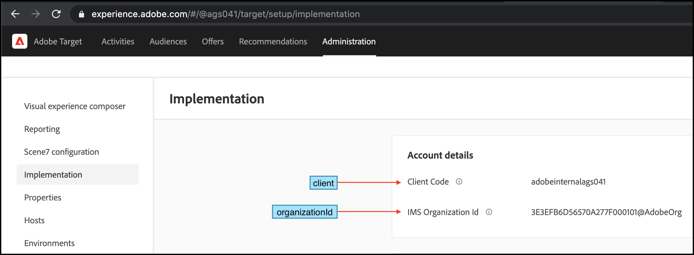

# Het downloaden, het opslaan, en het bijwerken van het regelartefact automatisch via [!DNL Adobe Target] SDK

Deze aanpak is het beste als u de [!DNL Adobe Target] SDK wordt tegelijk geïnitialiseerd en gestart. Het regelartefact wordt gedownload door [!DNL Adobe Target] SDK en in het cachegeheugen opgeslagen voordat uw webservertoepassing aanvragen gaat verzenden. Wanneer uw webtoepassing actief is, [!DNL Adobe Target] de besluiten zullen worden uitgevoerd gebruikend het in-geheugenregelartefact. Het in de cache geplaatste regelartefact wordt bijgewerkt op basis van de `pollingInterval` u geeft op tijdens de initialisatiestap van de SDK.

## Overzicht van de stappen

1. De SDK installeren
1. De SDK initialiseren
1. Opslaan en het artefact van de regel gebruiken

## 1. Installeer de SDK

>[!BEGINTABS]

>[!TAB NPM]

```javascript {line-numbers="true"}
npm i @adobe/target-nodejs-sdk -P
```

>[!TAB MVN]

```javascript {line-numbers="true"}
<dependency>
    <groupId>com.adobe.target</groupId>
    <artifactId>java-sdk</artifactId>
    <version>1.0</version>
</dependency>
```

>[!ENDTABS]

## 2. Initialiseer de SDK

1. Importeer eerst de SDK. Importeer naar hetzelfde bestand waaruit u het opstarten van de server kunt beheren.

   **Node.js**

   ```javascript {line-numbers="true"}
   const TargetClient = require("@adobe/target-nodejs-sdk");
   ```

   **Java**

   ```javascript {line-numbers="true"}
   import com.adobe.target.edge.client.ClientConfig;
   import com.adobe.target.edge.client.TargetClient;
   ```

1. Om SDK te vormen, gebruik creeer methode.

   **Node.js**

   ```javascript {line-numbers="true"}
   const CONFIG = {
       client: "<your target client code>",
       organizationId: "your EC org id",
       decisioningMethod: "on-device",
       pollingInterval : 300000,
       events: {
           clientReady: startWebServer
       }
   };
   
   const TargetClient = TargetClient.create(CONFIG);
   
   function startWebServer() {
       //Adobe Target SDK has now downloaded the JSON Artifacts and is available in the memory.
       //You can start your web server now to serve requests now.
   }
   ```

   **Java**

   ```javascript {line-numbers="true"}
   ClientConfig config = ClientConfig.builder()
       .client("<you target client code>")
       .organizationId("<your EC org id>")
       .build();
   TargetClient targetClient = TargetClient.create(config);
   ```

1. Zowel de client als de organisatie-id kunnen worden opgehaald van [!DNL Adobe Target] door naar **[!UICONTROL Administration]** > **[!UICONTROL Implementation]**, zoals u hier ziet.

   &lt;!— Voeg image-client-code.png toe —>
   

## 3. Bewaar en gebruik de regelartefact

U te hoeven niet om het regelartefact zelf te beheren en het roepen van de methodes van SDK zou ongecompliceerd moeten zijn.

>[!BEGINTABS]

>[!TAB Node.js]

```javascript {line-numbers="true"}
//req is the request object from the server request listener method
const targetCookie = req.cookies[TargetClient.TargetCookieName];
const request = {
    context: {
        channel: "web"
    },
    execute: {
        mboxes: [{
            address: { url: req.headers.host + req.originalUrl },
            name: "on-device-homepage-banner"
        }],
    },
};

TargetClient.getOffers({
    request,
    targetCookie
}).then(function(response) {
    //This Target response is coming from the In-memory Target artifact.
    console.log("Target response", response);
}).catch(function(err) {
    console.error("Target:", err);
})
```

>[!TAB Java]

```java {line-numbers="true"}
MboxRequest mbox = new MboxRequest().name("homepage").index(0);
TargetDeliveryRequest request = TargetDeliveryRequest.builder()
    .context(new Context().channel(ChannelType.WEB))
    .execute(new ExecuteRequest().mboxes(Arrays.asList(mbox)))
    .build();
TargetDeliveryResponse response = targetClient.getOffers(request);
```

>[!ENDTABS]

>[!NOTE]
>
>In het bovenstaande codevoorbeeld wordt het `TargetClient` object bevat een verwijzing naar het artefact van de in-geheugenregel. Wanneer u dit voorwerp voor het aanhalen van standaardmethodes SDK gebruikt, gebruikt het het in-geheugenregelartefact voor besluit. Als uw toepassing zodanig gestructureerd is dat u de methodes SDK in dossiers buiten moet roepen die initialiseert en aan cliëntverzoeken luistert, en als die dossiers geen toegang tot het voorwerp TargetClient hebben, dan kunt u de JSON nuttige lading downloaden en het opslaan in een lokaal JSON dossier dat op andere dossiers wordt verbruikt, die SDK moeten initialiseren. Dit wordt uitgelegd in het volgende gedeelte, betreffende [het regelartefact downloaden met een JSON-payload](rule-artifact-json.md).

Hier volgt een voorbeeld waarin een webtoepassing wordt gestart nadat het [!DNL Adobe Target] SDK.

>[!BEGINTABS]

>[!TAB Node.js]

```javascript {line-numbers="true"}
const express = require("express");
const cookieParser = require("cookie-parser");
const TargetClient = require("@adobe/target-nodejs-sdk");
const CONFIG = {
    client: "<your target client code>",
    organizationId: "your EC org id",
    decisioningMethod: "on-device",
    pollingInterval : 300000,
    events: {
        clientReady: startWebServer
    }
};

const app = express();
const targetClient = TargetClient.create(CONFIG);

app.use(cookieParser());

function saveCookie(res, cookie) {
  if (!cookie) {
    return;
  }

  res.cookie(cookie.name, cookie.value, {maxAge: cookie.maxAge * 1000});
}

const getResponseHeaders = () => ({
  "Content-Type": "text/html",
  "Expires": new Date().toUTCString()
});

function sendSuccessResponse(res, response) {
  res.set(getResponseHeaders());
  saveCookie(res, response.targetCookie);
  res.status(200).send(response);
}

function sendErrorResponse(res, error) {
  res.set(getResponseHeaders());
  res.status(500).send(error);
}

function startWebServer() {
    app.get('/*', async (req, res) => {
    const targetCookie = req.cookies[TargetClient.TargetCookieName];
    const request = {
        execute: {
        mboxes: [{
            address: { url: req.headers.host + req.originalUrl },
            name: "on-device-homepage-banner" // Ensure that you have a LIVE Activity running on this location
        }]
        }};

    try {
        const response = await targetClient.getOffers({ request, targetCookie });
        sendSuccessResponse(res, response);
    } catch (error) {
        console.error("Target:", error);
        sendErrorResponse(res, error);
    }
    });

    app.listen(3000, function () {
    console.log("Listening on port 3000 and watching!");
    });
}
```

>[!TAB Java]

```java {line-numbers="true"}
import com.adobe.target.edge.client.ClientConfig;
import com.adobe.target.edge.client.TargetClient;
import com.adobe.target.delivery.v1.model.ChannelType;
import com.adobe.target.delivery.v1.model.Context;
import com.adobe.target.delivery.v1.model.ExecuteRequest;
import com.adobe.target.delivery.v1.model.MboxRequest;
import com.adobe.target.edge.client.entities.TargetDeliveryRequest;
import com.adobe.target.edge.client.model.TargetDeliveryResponse;

@Controller
public class TargetController {

  private TargetClient targetClient;

  TargetController() {
    // You should instantiate TargetClient in a Bean and inject the instance into this class 
    // but we show the code here for demonstration purpose.
    ClientConfig config = ClientConfig.builder()
        .client("<you target client code>")
        .organizationId("<your EC org id>")
        .build();
    targetClient = TargetClient.create(config);
  }

  @GetMapping("/")
  public String homePage() {
    MboxRequest mbox = new MboxRequest().name("homepage").index(0);
    TargetDeliveryRequest request = TargetDeliveryRequest.builder()
        .context(new Context().channel(ChannelType.WEB))
        .execute(new ExecuteRequest().mboxes(Arrays.asList(mbox)))
        .build();
    TargetDeliveryResponse response = targetClient.getOffers(request);
    // ...
  }
}
```

>[!ENDTABS]
